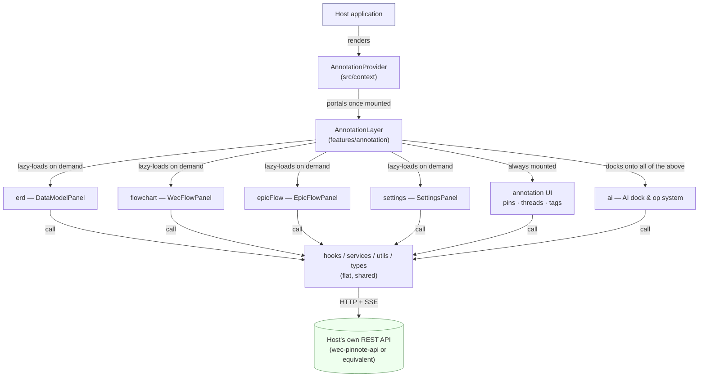
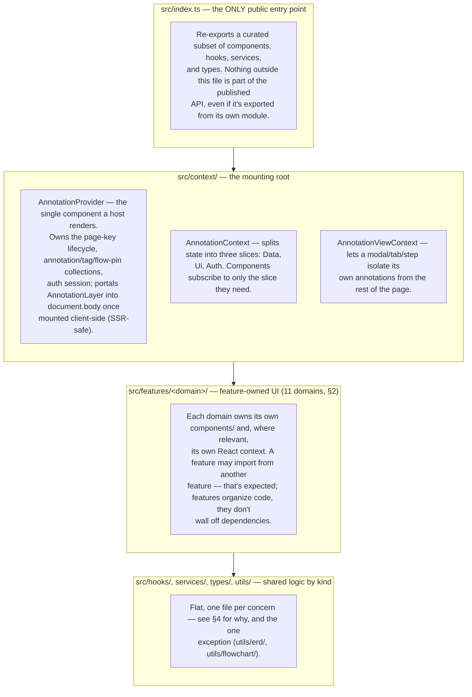
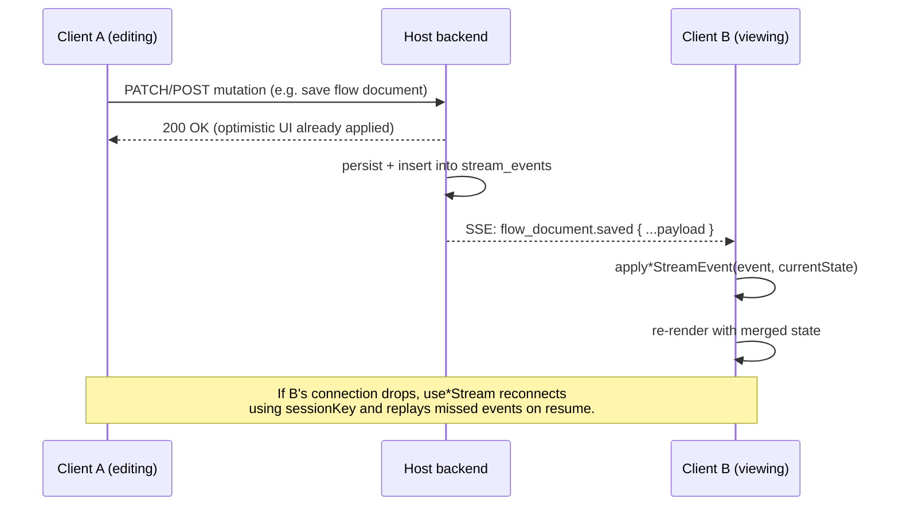
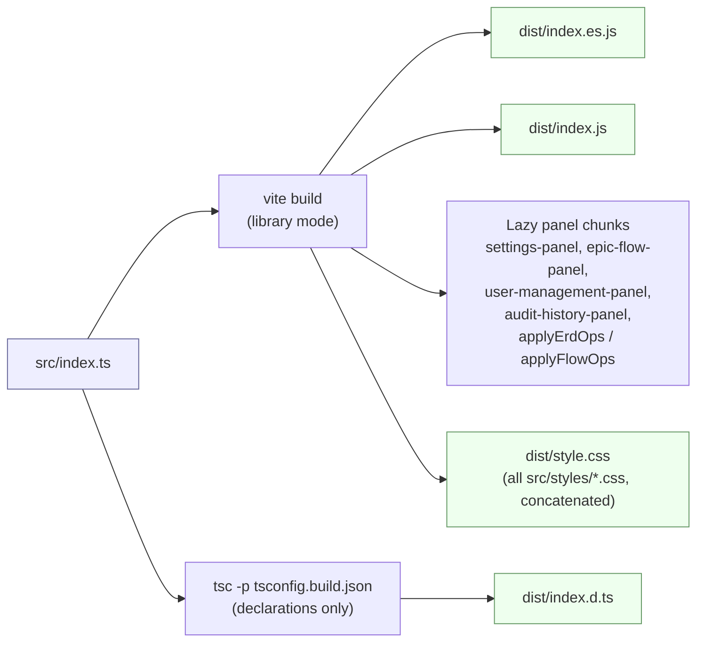

# Architecture

Internal technical reference for `wec-pinnote-lib`. This describes _how the code is organized and why_
— for _what the library does_ from a consumer's point of view, see the root [README.md](../README.md).

> **Reading this on GitHub?** The diagrams below are [Mermaid](https://mermaid.js.org) — they render
> automatically in the GitHub file viewer and in most modern Markdown previewers (VS Code's built-in
> preview included). If your viewer doesn't support Mermaid, each diagram is followed by enough prose
> to read without it.

## 0. At a glance

One host component (`AnnotationProvider`) mounts one orchestration root (`AnnotationLayer`), which
always renders the core annotation UI and lazily mounts every other feature's panel only when the
user opens it. Every feature ultimately talks to the **host's own backend** — this library never
holds data itself. See [§6](#6-real-time-updates) for how the SSE side of that arrow works.

## 1. Layering

## 2. Feature domains

| Domain (`src/features/<name>`) | Owns                                                                                                                                                                                                                                                                                                                                                                                   | Public panel(s)                                                                           |
| ------------------------------ | -------------------------------------------------------------------------------------------------------------------------------------------------------------------------------------------------------------------------------------------------------------------------------------------------------------------------------------------------------------------------------------- | ----------------------------------------------------------------------------------------- |
| `annotation`                   | The core pin/comment/thread UI: overlay, toolbar, composer, thread panel, status select, tags-on-page, comments list. This is the domain `AnnotationLayer` itself belongs to — it's the orchestration root that lazy-mounts every other feature's panel.                                                                                                                               | _(mounted automatically by `AnnotationProvider`, no separate export)_                     |
| `ai`                           | The AI assistant dock: chat, inline edit bar, model switcher, connector/integrations UI, prompt templates, and the **op system** (`ai/ops/`) that parses and applies model-proposed changes to the ERD/flowchart documents. Also owns the session stores (`sessionReducer`, `aiSelectionStore`, `aiPreviewStore`) and `AiStreamHub`, the shared SSE connection every AI UI listens to. | _(consumed via hooks/components, no single top-level panel — it docks onto other panels)_ |
| `erd`                          | The data-model (ERD) editor: entities, fields, relationships, enums, validation, DDL/code export.                                                                                                                                                                                                                                                                                      | `DataModelPanel`                                                                          |
| `flowchart`                    | The flowchart editor ("WecFlow"): nodes, edges, alignment, validation, history/undo.                                                                                                                                                                                                                                                                                                   | `WecFlowPanel`                                                                            |
| `epicFlow`                     | The kanban board of epics and user stories.                                                                                                                                                                                                                                                                                                                                            | `EpicFlowPanel`                                                                           |
| `flowPin`                      | Pins that open a flowchart scoped to one page element (distinct from the full `flowchart` editor feature).                                                                                                                                                                                                                                                                             | `FlowPinPanel`, `FlowPinPicker`, `FlowPinPin`                                             |
| `tags`                         | Tag pins placed on page elements (distinct from the Settings tag _admin_ UI, which manages the tag palette itself).                                                                                                                                                                                                                                                                    | `TagPin`, `TagPicker`                                                                     |
| `settings`                     | The admin settings surface: organizations, projects, tags (palette admin), integrations, and the analytics dashboard (`Dashboard/` subfolder).                                                                                                                                                                                                                                         | `SettingsPanel`                                                                           |
| `userManagement`               | User CRUD, password reset, role assignment.                                                                                                                                                                                                                                                                                                                                            | `UserManagementPanel`                                                                     |
| `auditHistory`                 | The append-only audit log viewer.                                                                                                                                                                                                                                                                                                                                                      | `AuditHistoryPanel`                                                                       |
| `auth`                         | The library's built-in sign-in UI, used only when the host doesn't supply `getAuthToken`.                                                                                                                                                                                                                                                                                              | `LoginDialog`, `ToolbarAuthControl`                                                       |

Each domain's `components/` is flat (no further nesting) **unless** it has a genuinely separate
sub-concern with several files of its own — the only two cases today are `erd/components/erd/`
(the diagram canvas internals, further split into `erd/properties/` for the field/relationship
property panels) and `settings/components/Dashboard/` (the analytics widgets). There's no fixed rule
for _when_ a sub-concern earns its own folder; use judgment, and prefer flat until a cluster is
clearly its own thing.

## 3. Barrel (`index.ts`) policy

**Component folders do not have `index.ts` barrels.** A component folder exists only when a component
is genuinely made of several files (e.g. `annotation/components/AnnotationListPanel/` has nine files);
in that case, import the specific file you need (`.../AnnotationListPanel/AnnotationListPanel`), not
the folder. A component that's just one file lives directly under its feature's `components/` (or
under the shared `src/components/` for cross-feature primitives) — no wrapper folder at all.

This is a deliberate choice, not an oversight: barrels that only exist to avoid writing one import
path add a file for no behavioral benefit, and a barrel re-exporting dozens of symbols (as
`src/components/primitives/index.ts` once did) makes it impossible to tell, from an import line alone,
which file actually defines something.

**The one exception** is `src/features/ai/ops/index.ts` — a real aggregation of ~15 op-parsing/applying
modules into one registry export (`AI_OP_REGISTRY` and friends), not a thin wrapper around a single
component. Barrels like this — ones that combine several independent modules into a genuinely new,
cohesive export — are fine; it's specifically the "folder exists only to re-export its own single
component" pattern that's banned.

## 4. Why logic folders stay flat

`hooks/`, `services/`, and `types/` are flat — one file per concern, not grouped into per-feature
subfolders — even though `src/features/` groups UI by domain. Two reasons:

1. **Logic files are named for their concern already.** `useAnnotationStream.ts`, `erdService.ts`,
   `epicFlow.types.ts` are self-describing; a `hooks/annotation/`, `services/erd/`,
   `types/epicFlow/` subfolder layer adds a directory traversal without adding information the
   filename didn't already carry.
2. **It avoids import-depth churn for logic that's reused across features.** `streamPayloadGuards.ts`,
   `resourceCache.ts`, `useSkeletonGate.ts`, and similar cross-cutting helpers used by several features
   would otherwise have to live in one arbitrary feature's subfolder or a separate `shared/` bucket.
   Keeping the whole kind-folder flat means every concern — feature-specific or cross-cutting — lives
   at the same, single predictable depth: `hooks/<name>.ts`, `services/<name>Service.ts`,
   `types/<name>.types.ts`.

`services/` additionally follows a `<domain>Service.ts` naming convention for its per-domain REST
clients (`erdService.ts`, `authService.ts`, `epicFlowService.ts`, …); a handful of names don't carry a
domain prefix because they're cross-cutting infrastructure rather than a domain's API client:
`apiClientFactory.ts`, `httpClient.ts`, `streamApi.ts`, `actorIdentity.ts`.

**`utils/` is the one exception that keeps subfolders**: `utils/erd/` (19 files: the ERD engine,
geometry, DDL generation per-dialect, code export, serialization, validation) and `utils/flowchart/`
(16 files: the flowchart engine, geometry, alignment, history, serialization, validation) are each
large enough, and cohesive enough as a unit, that flattening them would just scatter ~35 files across
the top of `utils/` with no corresponding gain — unlike the single-file-per-domain services/types/hooks
above, these are multi-file _subsystems_. This split predates the rest of this session's
reorganization and was kept deliberately rather than flattened to match.

## 5. State management patterns

There is no global store (no Redux/Zustand/Jotai). State lives in one of four places, chosen per
concern:

- **React Context** (`context/AnnotationContext.ts`, `features/erd/ErdContext.ts`,
  `features/flowchart/FlowContext.ts`, `features/ai/AiRuntimeContext.tsx`) — for state a whole subtree
  of components needs, scoped to one mounted provider instance.
- **Custom hooks with internal `useState`/`useReducer`** — the default for anything local to one
  feature's data lifecycle (`useAnnotations`, `useDataModelDocument`, `useFlowDocument`, …).
- **Plain reducer/store modules** (`features/ai/sessionReducer.ts`, `aiSelectionStore.ts`,
  `aiPreviewStore.ts`) — for AI session/selection/preview state that needs to be read and updated from
  several unrelated component trees (the inline bar, the dock, the floating button) without threading
  it through context. These are plain subscribable objects (`useSyncExternalStore`-style), not a
  context provider, because their consumers aren't always inside the same React subtree.
- **`utils/resourceCache.ts`** — a small shared fetch cache (ETag-aware, TTL + retry/backoff via
  `backoff.ts`) used by `useCachedResource` and the various `prefetch*` helpers, so that e.g. opening
  Settings after the AI dock has already warmed `GET /ai/me` doesn't refire the request.

## 6. Real-time updates

Every live-updating feature (annotations, EpicFlow, the data-model/flowchart editors, the AI dock,
analytics) is driven by one shared pattern: a server-sent-events connection per concern, with a
`StreamEvent` union (`types/stream.types.ts`) typed per event name
(`annotation.created`, `flow_document.saved`, `data_model.published`, …), an `apply*StreamEvent`
reducer-style function that folds one event into existing client state, and a `use*Stream` hook that
owns the `EventSource`/reconnect lifecycle and calls that reducer. `AiStreamHub`
(`features/ai/AiStreamHub.ts`) is the one exception shaped slightly differently: because many
unrelated AI UI surfaces (chat, inline bar, dock, floating button) all need the same event stream
simultaneously, it's a single shared hub with multiple listeners, rather than one hook per consumer
re-opening its own connection.

Reconnection always carries a `sessionKey` (not a raw auth token) specifically so the stream can
reconnect across a session change (sign-out/sign-in, token refresh) without losing its place or
needing the caller to re-derive a fresh token on every reconnect attempt.

## 7. Build pipeline

- **Vite library mode** (`vite.config.ts`): entry `src/index.ts`, output both `es` and `cjs` formats
  (`dist/index.es.js`, `dist/index.js`), `react`/`react-dom`/`react/jsx-runtime` externalized (peer
  dependencies, never bundled).
- **Manual chunk splitting**: the admin/editor panels that most consumers won't open on every page
  load — Settings, UserManagement, AuditHistory, EpicFlow, and the AI op-appliers — are split into
  their own chunks (`settings-panel`, `user-management-panel`, `audit-history-panel`,
  `epic-flow-panel`, `applyErdOps`/`applyFlowOps`) via `manualChunks` in `vite.config.ts`, and
  correspondingly lazy-loaded (`React.lazy(() => import(...))`) from `AnnotationLayer.tsx`. Everything
  else collapses into one `shared` chunk. **If you move a file that one of `vite.config.ts`'s
  `lazyPanelDirectories`/`sharedPanelModules` path literals points at, update those literals too** —
  they're plain string matches against the resolved module id, not real imports, so no codemod or
  type error will catch a stale one.
- **Type declarations**: emitted separately by `tsc -p tsconfig.build.json` (declaration-only pass)
  after the Vite build, into `dist/`.
- **CSS**: all of `src/styles/*.css` is imported once, centrally, by `AnnotationProvider.tsx`, and
  Vite's `cssCodeSplit: false` setting concatenates everything into a single `dist/style.css` the host
  imports once (`import "wec-pinnote-lib/style.css"`). There is no CSS-in-JS and no per-component
  stylesheet — see the note on `styles/annotation.css` in [DEVELOPMENT.md](DEVELOPMENT.md#known-gaps)
  if you're touching styles.
- **`"use client"` banner**: injected into every output chunk (`output.banner` in `vite.config.ts`) so
  the package can be imported directly from a Next.js App Router client component.

## 8. `examples/demo`

`examples/demo` is a small standalone Vite + React app (own `package.json`, own `node_modules`, not an
npm workspace member) whose `vite.config.ts` aliases the package name straight to this repository's own
`src/index.ts` and `src/styles/annotation.css` — **not** to the built `dist/` output. This makes the
inner dev loop fast (no rebuild step between editing the library and seeing it in the demo), but it
also means `npm run demo` never exercises what a real consumer actually installs (the compiled
`dist/`, the `package.json` `exports` map, the CJS/ESM split). Before relying on the demo to validate a
packaging change (not a behavior change), build the library and smoke-test `dist/` directly, or point
the demo's alias at `dist/` temporarily.

## 9. Testing

Vitest is split into two projects (`vitest.config.ts`):

- **`node`** (`test/**/*.test.{ts,tsx}`, excluding `test/dom/`) — pure logic: engines, reducers,
  validators, API client shape, codegen. Runs in plain Node, no DOM.
- **`dom`** (`test/dom/**/*.test.{ts,tsx}`) — anything that mounts a component or touches the DOM
  (`happy-dom` environment).

`test/` is flat and mirrors `src/` by filename only, not by directory — a deliberate (if imperfect)
tradeoff kept as-is; see [DEVELOPMENT.md](DEVELOPMENT.md#known-gaps) if this becomes hard to navigate
as the suite grows further.

## 10. SSR safety

`AnnotationProvider` renders safely on the server: every browser-only API (`window`, `document`,
`localStorage`) is guarded, and `AnnotationLayer` is only `createPortal`'d into `document.body` once
the provider has mounted on the client (a `useEffect`-gated flag, not rendered during SSR). Combined
with the `"use client"` banner (§7), this is what makes `import { AnnotationProvider } from
"wec-pinnote-lib"` safe inside a Next.js App Router client component without a dynamic-import
workaround.
