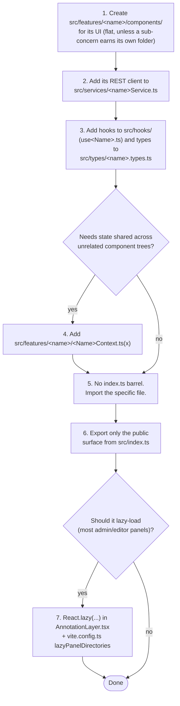
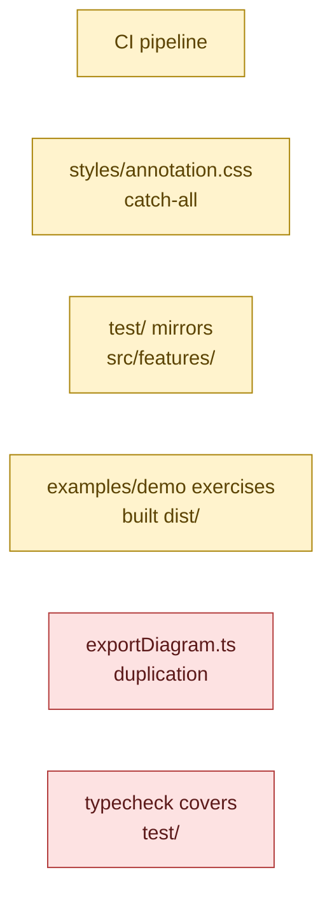

# Development Guide

## Prerequisites

- Node >= 20 (`package.json` `engines`).
- A `.env` file at the repo root (gitignored) with the two variables the library's own build reads —
  see [Environment variables](#environment-variables) below. Not required to run `typecheck`/`lint`/
  `test`; only `dev`/`build`/`demo` consume them.

## Scripts

| Script                                    | What it does                                                                                                                                                           |
| ----------------------------------------- | ---------------------------------------------------------------------------------------------------------------------------------------------------------------------- |
| `npm run dev`                             | `vite build --watch` — rebuilds `dist/` on every change. Use this when developing against a host app that consumes the built package (option B1 in the README).        |
| `npm run build`                           | `vite build && tsc -p tsconfig.build.json` — the full build: bundles, then emits `.d.ts` declarations into `dist/`. Runs automatically on `npm install` via `prepare`. |
| `npm run typecheck`                       | `tsc -p tsconfig.json --noEmit` — type-checks `src/` only (not `test/`, not `examples/demo/`; see [Known gaps](#known-gaps)).                                          |
| `npm run lint` / `npm run lint:fix`       | ESLint over the whole repo except `dist/`, `examples/demo/dist/`, `node_modules/`.                                                                                     |
| `npm run format` / `npm run format:check` | Prettier write / check.                                                                                                                                                |
| `npm test`                                | `vitest run` — the full suite once (see [Testing](#testing)).                                                                                                          |
| `npm run demo`                            | Runs `examples/demo`'s own `dev` script (aliased straight to this repo's `src/`, not `dist/` — see [ARCHITECTURE.md](ARCHITECTURE.md#8-examplesdemo)).                 |
| `npm run demo:build`                      | Builds `examples/demo` (a real Vite app build, output to its own `dist/`).                                                                                             |

There's no `test:watch` or coverage script today — run `npx vitest` (no `run`) for watch mode, or
`npx vitest run --coverage` if you need a coverage report (the `@vitest/coverage-*` provider isn't
installed; add it first).

## Environment variables

The library's own `.env` (used only by `npm run dev`/`build`/`demo`, read via `src/config/env.ts` and
exposed to the build with Vite's `envPrefix: "WEC_"`):

| Variable              | Purpose                                                                                                                                                         |
| --------------------- | --------------------------------------------------------------------------------------------------------------------------------------------------------------- |
| `WEC_PINNOTE_API_URL` | Default `apiBaseUrl` baked into `DEFAULT_PINNOTE_API_URL`, used by `examples/demo` and anywhere a consumer doesn't override `apiBaseUrl` in `AnnotationConfig`. |
| `WEC_USE_MOCK_API`    | When `true`, `examples/demo` uses the bundled in-memory mock API (`examples/demo/src/mock/`) instead of a real `wec-pinnote-api` backend.                       |

This file is gitignored and was previously committed by mistake (cleaned up in this session's git
history going forward — the old commit still has it, so rotate anything sensitive if you ever put
real credentials in it; today it only holds a URL and a boolean).

## Adding a new feature domain



1. Create `src/features/<name>/components/` for its UI. Keep it flat unless a sub-concern clearly
   needs its own folder (see [ARCHITECTURE.md §2](ARCHITECTURE.md#2-feature-domains)).
2. Add its REST client to `src/services/<name>Service.ts` (or reuse an existing one if the domain
   doesn't need its own backend calls).
3. Add its hooks to `src/hooks/` (flat, `use<Name>.ts`) and its types to `src/types/<name>.types.ts`.
4. If it needs shared state across unrelated component trees, add a context in
   `src/features/<name>/<Name>Context.ts(x)` (see existing examples: `ErdContext.ts`, `FlowContext.ts`).
5. **Do not add an `index.ts` barrel** to the new `components/` folder or to any single-component
   subfolder — import the specific file. See [ARCHITECTURE.md §3](ARCHITECTURE.md#3-barrel-indexts-policy)
   for why, and when a real aggregating barrel (like `ai/ops/index.ts`) is the right call instead.
6. Export only what should be public from `src/index.ts`. Being reachable from inside `src/features/`
   does not make something public — `src/index.ts` is the only contract host apps can rely on.
7. If the new panel should be lazy-loaded (most admin/editor panels should), wire it into
   `AnnotationLayer.tsx`'s `React.lazy(() => import(...))` block, and add its directory to
   `vite.config.ts`'s `lazyPanelDirectories` (see [ARCHITECTURE.md §7](ARCHITECTURE.md#7-build-pipeline)).

## Testing

```mermaid
flowchart LR
    Q{"Does the test render\na component, call createRoot,\nor touch document?"}
    Q -- "no — pure logic" --> Node["test/&lt;name&gt;.test.ts\n(\"node\" project, no DOM)"]
    Q -- "yes" --> Dom["test/dom/&lt;name&gt;.test.tsx\n(\"dom\" project, happy-dom)"]
```

- `test/*.test.ts` — logic tests (Node project). Put a test here if it doesn't render anything.
- `test/dom/*.test.tsx` — component/DOM tests (`happy-dom` project). Put a test here if it mounts a
  component, uses `createRoot`, or touches `document`.
- `test/setup.ts` is shared setup for both projects; `test/dom/aiTestUtils.ts` has the DOM test
  helpers (`render`, `click`, `flush`) used across the AI component tests.
- Prefer `vi.mock` over reaching into real network calls; see any `test/dom/ai*.test.tsx` file for the
  established pattern (mock the service module, assert on the mock's calls).
- A test file that reads source files by path for static analysis (e.g. `test/aiOpsSchema.test.ts`'s
  import-graph check, `test/dashboardGate.test.ts`'s gating check) does so via a literal path string,
  **not** a module specifier — if you move the file it's checking, update that literal by hand; no
  codemod or type error will catch it.

## Known gaps

Carried over from the structural review in this repository's recent history (`git log` for the full
history of changes that produced the current layout) — not blockers, just open items, tracked here so
they don't get silently forgotten:



🟢 done · 🟡 open, safe to pick up · 🔴 blocked on something outside this repo's docs

- 🟡 **No CI.** `.github/workflows/` doesn't exist; lint/typecheck/test/build only run locally today.
  A workflow was added and then deliberately removed again in this repo's recent history — if you
  reintroduce one, note that `npm test` currently fails on the pre-existing failures below, so a
  naive pipeline will be red from the first run.
- 🟡 **`styles/annotation.css` is a mislabeled catch-all.** At ~11,000 lines it hosts styles for
  Settings, Auth, EpicFlow, Tags, Audit, and more — not just annotations — because every feature that
  doesn't have its own dedicated stylesheet (compare `datamodel.css`, `flowchart.css`, `ai.css`) ended
  up here by default. Splitting it needs **visual QA**: cascade order across split files is easy to
  get subtly wrong with no automated check, and this repo has no way to render the library and look at
  it. Safe path: split into same-order files and import them in that same order (no behavior change),
  then rename/reorganize with a human looking at the result in a browser.
- 🟡 **`test/` doesn't mirror `src/features/`.** It's flat, matched to `src/` by filename convention
  only. `vitest.config.ts`'s globs already support a mirrored layout with zero config changes, if/when
  it's worth doing — but doing it accurately requires categorizing all ~120 test files by the feature
  they actually exercise (not just guessing from the filename), which is a decent chunk of careful,
  low-risk-but-high-attention work rather than a quick mechanical pass.
- 🟡 **`examples/demo` never exercises the built `dist/`** — see
  [ARCHITECTURE.md §8](ARCHITECTURE.md#8-examplesdemo). Fixable with npm workspaces or a `file:../../dist`
  dependency; not done yet because it changes how contributors run the demo day-to-day and deserves a
  deliberate choice, not a silent default.
- 🔴 **`utils/erd/export/exportDiagram.ts` and `utils/flowchart/export/exportDiagram.ts`** duplicate an
  identical `escapeXml()` helper and SVG-wrapper boilerplate. Both files are part of an **in-progress,
  uncommitted export/codegen feature** at time of writing — deduplicating them now would mean editing
  code someone else is actively mid-way through. Revisit once that feature lands.
- 🔴 **`typecheck` doesn't cover `test/` or `examples/demo/`** (`tsconfig.json`'s `include` is `["src"]`
  only). Tried widening it: it immediately surfaces several dozen pre-existing type errors across the
  test suite (mock objects missing required fields, `noUncheckedIndexedAccess` violations in test
  assertions, etc.) — real drift from years of tests never being type-checked, not a quick toggle. Needs
  its own dedicated cleanup pass before `test/` can safely join `tsconfig.json`'s `include`.
