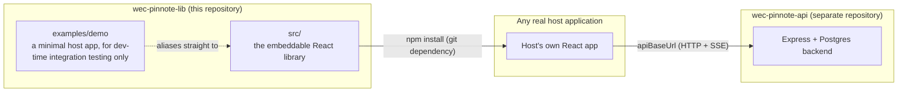

# Project Overview — wec-pinnote-lib

## What this is

`wec-pinnote-lib` is a **React component library**, not an application. It is published as a single
npm-style package (installed from its git repository, not the public npm registry — see
`package.json`'s `"license": "UNLICENSED"`) that a host web application embeds to get:

- **Website annotations** — Figma-like pins anchored to DOM elements, with threaded, @mention-aware
  comments and a status workflow.
- **Tags** — lightweight labels pinned to page elements.
- **Flow pins** — pins that open a flowchart editor scoped to one page element.
- **EpicFlow** — a kanban board of epics and user stories.
- **A data-model (ERD) editor** — entities, fields, relationships, enums, with DDL/code export.
- **A flowchart editor** ("WecFlow") — nodes, edges, validation, undo/redo.
- **An AI assistant dock** — chat, inline edit actions, and model-driven operations against the ERD
  and flowchart editors, backed by a user's own Claude or Codex connection.
- **Admin surfaces** — user management, organizations/projects, audit history, and a page-visit
  analytics dashboard.

The library owns none of this data. Every one of these features reads and writes through a REST API
the **host application** points it at (`apiBaseUrl` in `AnnotationConfig`) — see
[API_CONTRACT.md](API_CONTRACT.md) for the exact endpoints. The library has no database access and
reads no environment variables belonging to the host; its own `.env` only configures a default API
URL and a mock-API toggle for local development of the library itself (see
[docs/DEVELOPMENT.md](DEVELOPMENT.md)).

## Where it sits in the wec_pinnote ecosystem

`examples/demo` is the only "application" in this repository, and it exists purely to integration-test
the library — it is not a product in its own right. See
[ARCHITECTURE.md §8](ARCHITECTURE.md#8-examplesdemo) for how it wires up to the library's source, and
why it doesn't fully substitute for testing against the real built package.

## Who uses this repository

- **Library engineers** — add or change a feature (an annotation behavior, the ERD/flowchart editors,
  the AI dock, an admin panel) inside `src/`, following the conventions in
  [ARCHITECTURE.md](ARCHITECTURE.md) and [DEVELOPMENT.md](DEVELOPMENT.md).
- **Host application engineers** — consume the published package's public API (`src/index.ts`). Start
  with the root [README.md](../README.md), which documents every user-facing behavior, configuration
  option, and integration pattern in detail (DOM anchoring, auth modes, SSR, real-time streams, the
  AI dock, etc.). This `docs/` folder is the complementary **internal/technical** reference — it does
  not repeat what the README already covers well.

## Tech stack

| Concern         | Choice                                                                                                                                                                                |
| --------------- | ------------------------------------------------------------------------------------------------------------------------------------------------------------------------------------- |
| UI framework    | React 18 (peer dependency — the library does not bundle React)                                                                                                                        |
| Language        | TypeScript 5.7, `strict: true`, `verbatimModuleSyntax: true`                                                                                                                          |
| Build           | Vite 6 (library mode, dual ESM + CommonJS output, manual chunk splitting)                                                                                                             |
| Tests           | Vitest 5 (two projects: plain Node and `happy-dom`)                                                                                                                                   |
| Lint/format     | ESLint 9 flat config (`typescript-eslint`, `react-hooks`) + Prettier                                                                                                                  |
| Styling         | Plain CSS, shipped as a single `dist/style.css`, imported once by the host                                                                                                            |
| Validation      | None at runtime for the library's own API calls (hand-written fetch wrappers); `zod` only appears as _generated output text_ inside the ERD code-exporter, never as a real dependency |
| Package manager | npm (no workspaces; `examples/demo` has its own `node_modules`, see [ARCHITECTURE.md](ARCHITECTURE.md#examplesdemo))                                                                  |

## Core design principles

These drive most of the architectural decisions documented in [ARCHITECTURE.md](ARCHITECTURE.md); see
the root README's "Core Principles" section for the full user-facing rationale behind each:

1. The host owns the backend — the library is a pure client.
2. Element-anchored positioning with a fallback, never a silently-lost pin.
3. Router-agnostic page identification (`getPageKey()` or `pathname`).
4. Host-provided or built-in authentication, host always wins.
5. Optimistic, rollback-capable writes for every mutation.
6. SSR-safe — portals only after client mount, ships a `"use client"` directive.

## Documentation map

| Document                                               | Purpose                                                                                                                 |
| ------------------------------------------------------ | ----------------------------------------------------------------------------------------------------------------------- |
| [README.md](../README.md)                              | User-facing behavior, configuration, and integration guide. Start here if you're consuming the library.                 |
| [PROJECT_OVERVIEW.md](PROJECT_OVERVIEW.md) (this file) | What the project is, who it's for, how the docs are organized.                                                          |
| [ARCHITECTURE.md](ARCHITECTURE.md)                     | Internal technical design: folder structure, feature domains, build pipeline, state management, streaming, conventions. |
| [API_CONTRACT.md](API_CONTRACT.md)                     | The full backend REST contract the library's `services/` layer calls.                                                   |
| [DEVELOPMENT.md](DEVELOPMENT.md)                       | Scripts, environment setup, testing, linting, build, and how to add a new feature.                                      |
| [features/](features/)                                 | One detailed, end-to-end doc per feature — see below.                                                                   |

### Per-feature docs

Each covers that feature's full user-facing flow, technical wiring, its own AI integration where one
exists, and a table of specific scenarios/edge cases — with colored Mermaid diagrams throughout.

| Feature                                                 | Doc                                              |
| ------------------------------------------------------- | ------------------------------------------------ |
| Annotations, comments, threads, @mentions, tags-on-page | [features/ANNOTATION.md](features/ANNOTATION.md) |
| EpicFlow (epics / user stories)                         | [features/EPIC_FLOW.md](features/EPIC_FLOW.md)   |
| Data Model (ERD editor)                                 | [features/DATA_MODEL.md](features/DATA_MODEL.md) |
| Flowchart (WecFlow editor)                              | [features/FLOWCHART.md](features/FLOWCHART.md)   |
| Settings (admin, dashboard, integrations)               | [features/SETTINGS.md](features/SETTINGS.md)     |
| AI dock (chat, connectors, quick actions)               | [features/AI.md](features/AI.md)                 |
