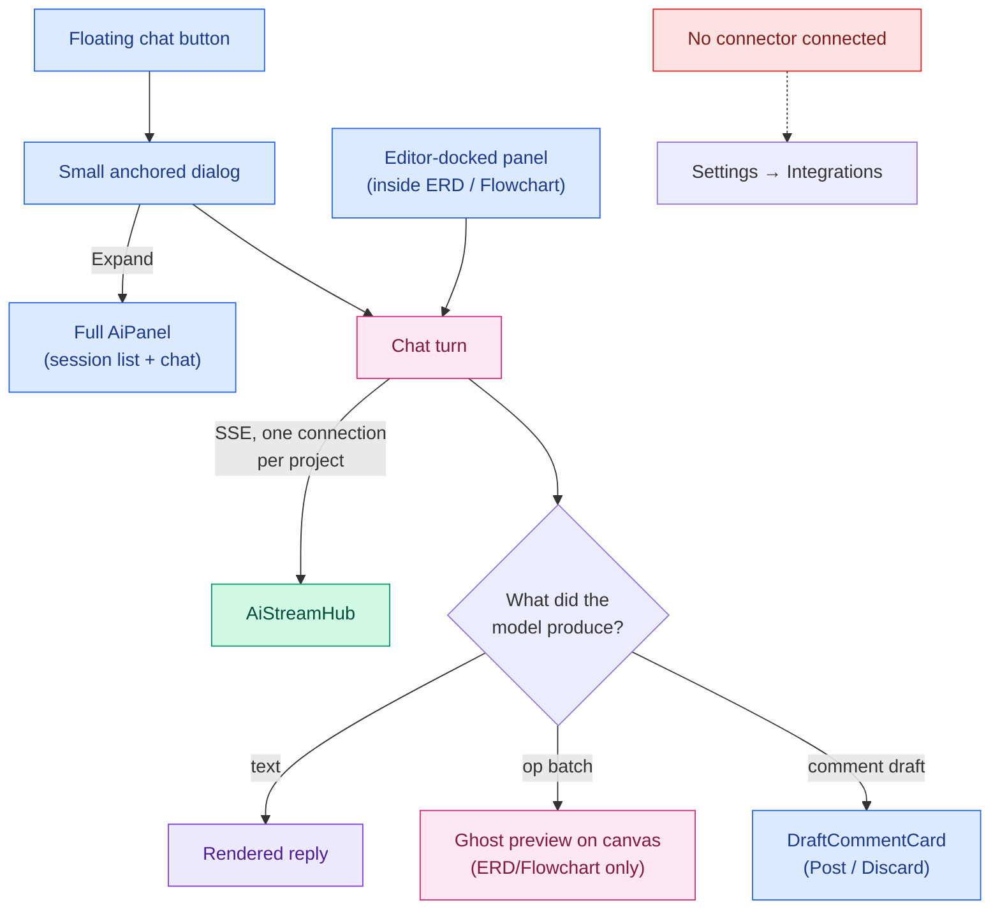
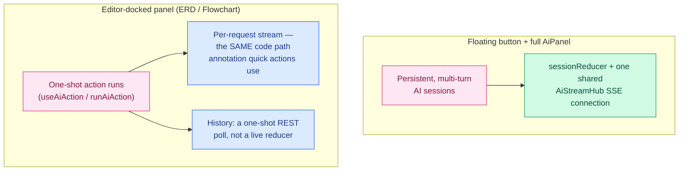
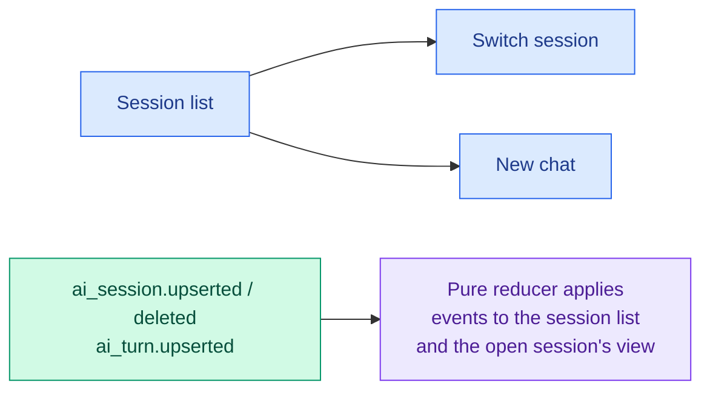
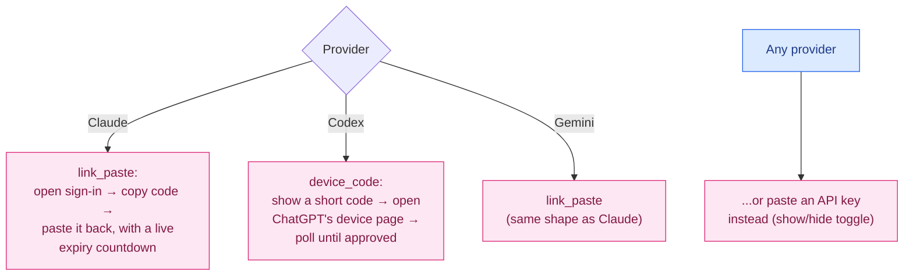
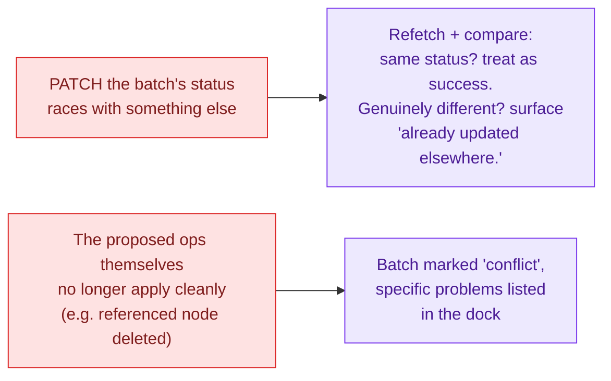

# Feature: AI Dock

The AI assistant — chat sessions, inline quick actions, connector management, and the shared op-batch
preview/apply machinery that the Data Model and Flowchart editors both plug into. This doc covers the
AI feature **as its own UI surface**; where another feature's doc already covers its specific AI
integration in depth (ERD's op types, Flowchart's auto-layout, Annotation's quick actions), this doc
links there rather than repeating it.

> Color key (consistent across `docs/features/`): 🔵 user action · 🟣 client state · 🟠 network call ·
> 🟢 real-time (SSE) · 🩷 AI-specific · 🔴 error / rollback / conflict.

## At a glance

## 1. Two surfaces, two genuinely different mechanisms

It's tempting to assume the floating chat button and the editor-docked panel are the same chat
experience in two places. **They're not** — they're built on two different underlying mechanisms that
happen to share some visual language:

- **Floating button** (`AiFloatingButton`) — a draggable bubble (position remembered per project),
  visible only when AI is available, connected, and the dock isn't already open. Clicking opens a
  small anchored dialog near the button; below a certain viewport width it becomes a full-screen
  sheet instead. An **Expand** button promotes it to the full `AiPanel`. This surface and the full
  panel are genuinely persistent, multi-turn **chat sessions** — see §2 and §3.
- **Editor-docked panel** (`AiEditorDock`, rendered inline inside the ERD and Flowchart editors,
  anchored into a slot the host editor exposes in its own toolbar row) looks similar but runs on a
  **completely different mechanism underneath**: it's built on the same one-shot **action-run** code
  path described in §6 for annotation quick actions (`useAiAction`/`runAiAction`), not on
  `sessionReducer`/`AiStreamHub`/the shared session infrastructure in §2–§3. Even what looks like
  "chat" inside the editor dock is modeled as an action invocation (optionally continued via a
  session id), and its message history is a plain one-shot REST fetch, not a live, reducer-driven
  view. If you're changing session/streaming behavior, changing it for the floating button and full
  panel does **not** automatically change it for the editor dock, and vice versa.

## 2. Sessions

> Applies to the floating button and full `AiPanel` only — the editor-docked panel doesn't use this
> mechanism at all; see §1.

Sessions are managed entirely by a pure, React-free reducer (`sessionReducer.ts`) that folds
real-time events into two shapes: the session **list** (respecting whatever filter is active —
mine-only, archived, actions-only) and one open session's **detail view** (messages, in-flight
streaming draft). The in-flight assistant response is built incrementally from streamed delta events
against a full periodic snapshot, with sequence-gap detection so a dropped event can't silently
corrupt the visible transcript — it's instead reconciled against the next full snapshot.

## 3. Chat turns and streaming

A single server-sent-events connection per project (ticket-authenticated, exponential backoff with
jitter, pauses after the tab has been hidden for a while and resumes on return) feeds every open
**session-based** surface — the floating dialog and the full panel — through one shared hub
(`AiStreamHub`) that fans events out to however many session views happen to be mounted at once,
rather than each one opening its own connection. **The editor-docked panel is not one of those
subscribers** — it streams its own one-shot action runs over a separate, per-request stream (see §1
and §6), not this shared hub.

While a turn is running, in-progress states (thinking, tool calls in flight) are shown distinctly from
the final rendered markdown reply. If the model's output is an op batch rather than plain text, that
hands off to the per-editor AI integration described in
[DATA_MODEL.md §6](DATA_MODEL.md#6-ai-integration) and
[FLOWCHART.md §7](FLOWCHART.md#7-ai-integration) — this doc owns the chat chrome, those docs own what
happens to a document once a batch is proposed.

## 4. Connectors UI

Three providers, each with its own real sign-in flow — this is the frontend half of
`wec-pinnote-api`'s `AI_CONNECTORS_CONTRACT.md`:

- **Claude & Gemini** use a "paste-the-code" flow: open the provider's sign-in in a new tab, copy the
  code it shows you, paste it back into the dialog (a visible countdown shows when the code expires,
  with a one-click way to get a fresh one).
- **Codex** defaults to a device-code flow: a short code is shown for you to enter on ChatGPT's own
  device-authorization page, with the dialog polling in the background ("Waiting for you to approve in
  ChatGPT…") until it's picked up — with help text if device-code sign-in is turned off on your
  ChatGPT account, and an escape hatch to connect via API key instead.
- **Every provider** also accepts a plain API key as an alternative to signing in at all.

Connecting a provider immediately makes it your new default for chat. The **Connections** sub-tab
lists whatever's currently connected with Check/Reconnect/Disconnect actions; disconnecting warns that
it signs you out of that provider but keeps your past chat history intact.

## 5. Op batch lifecycle (shared mechanics)

The preview → apply → accept/reject → save-and-report-revision lifecycle is identical in shape for
both the ERD and Flowchart editors — see
[DATA_MODEL.md §6](DATA_MODEL.md#6-ai-integration) for the full walkthrough with a diagram. The one
thing worth calling out here, since it's a detail of the dock itself rather than either editor:
**"preview" is not a separate visual layer drawn on top of your document — it's applied directly to
the live canvas as one real, undo-able history step.** The dock's `+N ~N −N` badge and the
ghost/highlight rendering are a visual _summary_ of that one step's diff, not a separate pending
state sitting apart from your actual document.

Conflict handling has two independent layers, and it matters which one you're looking at:

## 6. Quick actions (one-shot, no chat session)

A separate, simpler code path from everything above: a "quick action" is a single-prompt-in,
single-validated-output-out call, with no session, no multi-turn state, and no tool access. The
annotation feature's **Summarise thread**, **Draft reply with AI**, and **Improve with AI** all run
through this path — see
[ANNOTATION.md §5](ANNOTATION.md#5-ai-integration) for the user-facing detail. Friendly error messages
for this path map specific backend error codes (no context given, a draft is required, rate-limited,
the runtime is busy, no connector connected, or the action is disabled entirely) to plain-language
copy rather than raw error text.

## 7. Model and provider switching

Three registered providers, each with its own static model catalog (fast/balanced/strong tiers) used
even before a connector is live. Picking a model/effort combination that's no longer offered by your
currently-connected provider falls back automatically: preferred provider if still connected, else the
first connected one; preferred model if still offered, else the catalog's default; preferred effort if
offered, else a sensible middle default.

## 8. Prompt template administration

Reachable at Settings → Integrations → Prompts, gated behind the `canManageAiTemplates` permission.
This is where an admin edits the actual system prompts behind each quick action and chat surface —
the same SQL-seeded, editable-per-organization templates documented from the backend's point of view
in `wec-pinnote-api`'s `AI_PROTOCOL.md §Prompt templates`.

## 9. Edge cases

| Scenario                                                                       | What happens                                                                                                                                   |
| ------------------------------------------------------------------------------ | ---------------------------------------------------------------------------------------------------------------------------------------------- |
| No provider connected yet                                                      | Composers show a disabled-input hint with a direct "Connect" link into Settings → Integrations                                                 |
| AI is turned off entirely for this app                                         | Every AI surface (floating button, both editor docks, the Integrations tab's sub-tabs) renders nothing rather than a disabled/grayed-out state |
| You press Escape with your own turn running and focus in the composer          | Silently interrupts the turn first (no confirmation dialog) without closing the panel — a second Escape closes it                              |
| You press Escape with a turn running but focus elsewhere in the panel          | Closes immediately, even over a running turn — the interrupt-first behavior only applies when focus is in the composer                         |
| The backend simply has no AI routes at all (not configured, not just disabled) | Same end state as AI being off: `/ai/me` 404s, every AI control renders nothing, at most one ticket request and no EventSource is opened       |
| The SSE connection drops                                                       | "Reconnecting…" banner, exponential backoff, an explicit manual reconnect link once backoff is clearly not working                             |
| An AI batch's status-update PATCH races another client's identical update      | Treated as success once the refetch confirms the same end state — not surfaced as an error                                                     |
| An AI batch's proposed ops no longer apply (referenced item deleted)           | Marked `conflict` with specific problems listed, distinct from a document-save conflict                                                        |
| A persisted model/effort preference is no longer valid                         | Sanity-checked and falls back to a sensible default rather than silently failing                                                               |
