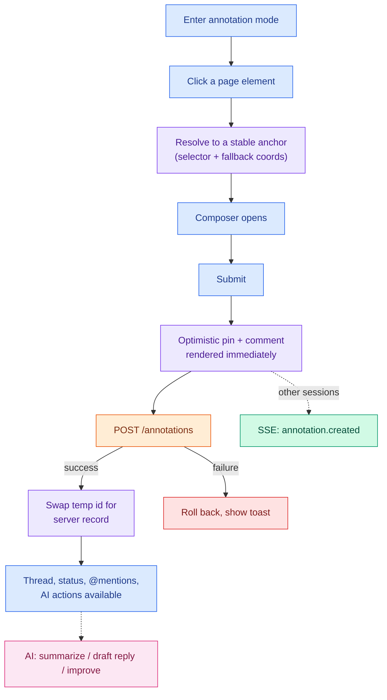
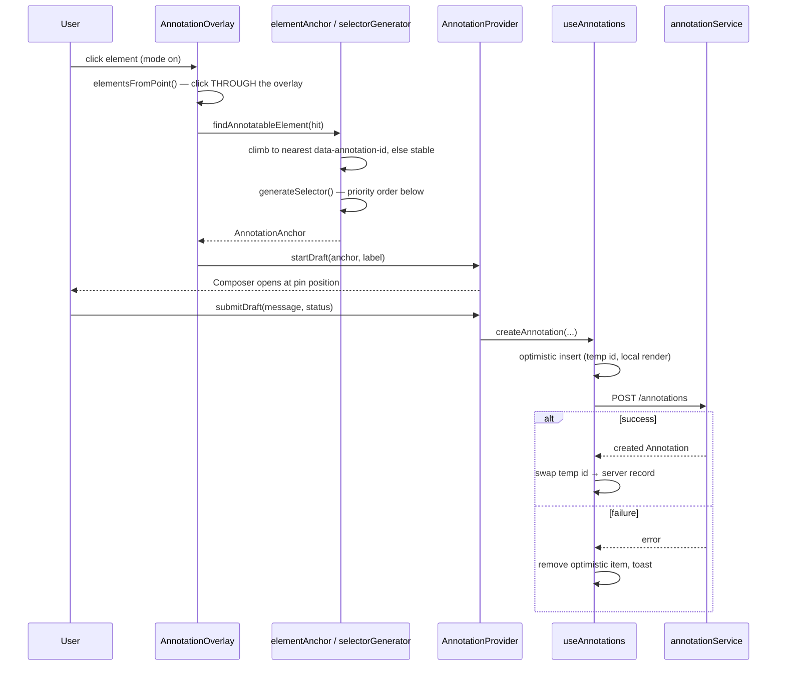
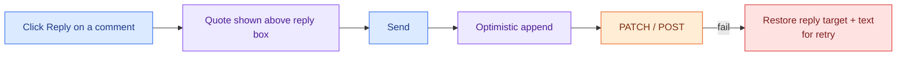
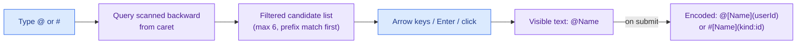
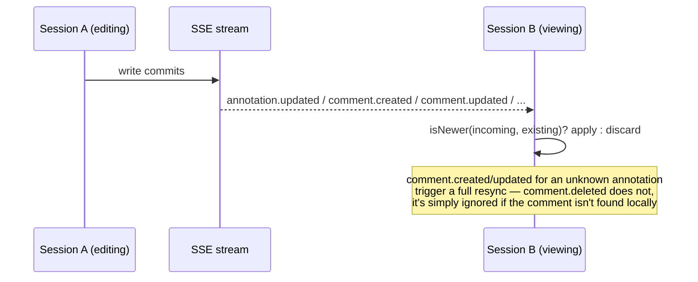
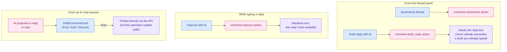

# Feature: Annotation

The core feature — Figma-like pins anchored to real DOM elements, with threaded, @mention-aware
comments and a status workflow. Every other feature in this library (tags, flow pins, the AI dock)
is mounted alongside this one from the same root component, `AnnotationLayer`.

> Diagrams use a consistent color key across every feature doc in `docs/features/`:
> 🔵 user action · 🟣 client state / optimistic update · 🟠 network call · 🟢 real-time (SSE) ·
> 🩷 AI-specific · 🔴 error / rollback / conflict.

## At a glance

## 1. Pin creation

**Anchor selector priority** (`src/utils/dom/selectorGenerator.ts`) — the single most important
mechanism for pin durability. Each is tried in order; the first unique match wins:

1. `data-annotation-id` attribute selector
2. A stable `#id` (rejected if it looks generated — React `:r..:`, Radix, MUI, hashes, etc.)
3. One of `data-annotation-id` / `data-name` / `data-field`
4. `[name="..."]`
5. `[aria-label="..."]`
6. Combined `tag[type][name]`
7. **Fallback**: a generated DOM path from the nearest scope root, using `nth-of-type` only where
   sibling tags actually collide

Every anchor also stores `relativeX`/`relativeY` — normally a 0–1 fraction of the element's full
bounding box, but if a `Range`-measured content box is meaningfully smaller (under 90% of the full
box in either dimension — think a short `` inside a tall padded container), the anchor is
flagged `contentRelative: true` and the fraction is measured against that tighter content box
instead, re-measured the same way on every later recompute. Raw viewport `fallbackX`/`fallbackY`
coordinates are stored too, used only if the element can never be re-resolved.

**Add `data-annotation-scope="<name>"` around repeated markup** (a shared modal used for two
different dialogs, for example) — it scopes both capture and resolution to that subtree so two
instances of the same component don't generate colliding selectors. When several scoped roots are
mounted at once, the **last one in document order** (not the visually topmost by z-index/paint order
— a separate mechanism, see occlusion below) is the active one.

**Optimistic create, in full**: `useAnnotations.ts`'s `createAnnotation` assigns a temp client id,
renders immediately, and tracks the temp id in a pending-set so a concurrent list refetch can't
clobber it mid-flight. On success the temp item is swapped for the server record (re-stamping the
author with the locally-known user object, since the server response may use a thinner shape). On
failure, the optimistic item is removed entirely and a dismissible toast appears
(`actionError`/`reportActionError`) — unless the failure is specifically a stale-account race (the
signed-in user changed between request and response), which is discarded silently with no toast. All
in-flight writes are tracked in an `AbortController` set and cancelled automatically on an account
switch; a handful of other mutations (`addComment`, `patchComment`, `setStatus`, `renameAnnotation`)
run the same stale-account check **after** a successful response too, and silently drop an update
that resolves under a since-changed account rather than applying it.

A failed **list load** doesn't fail wholesale on bad data either: malformed records (missing fields,
non-numeric anchor coordinates) are silently dropped from the response while well-formed ones still
render; a `401` is retried exactly once with a freshly-fetched token before giving up.

## 2. Comment threads, replies, and status

- **Permissions** (`src/utils/epicFlow/boardPermissions.ts` — a cross-feature module despite its
  path): a comment can be edited or deleted by its **author**, or by a user whose role is `admin` or
  `super_admin`. Deleting the **last** comment on a thread additionally requires delete-annotation
  rights (the pin itself disappears), so that check is slightly stricter than deleting any other
  reply. These checks are purely client-side UI gating (hide/disable the button) — the backend is the
  real authorization boundary.
- **Optimistic edit**: snapshots the full previous comment object before applying a patch; on failure
  restores the **entire** previous object (not a partial merge), so a failed edit can never leave the
  UI in a half-updated state.
- **Optimistic delete**: removes the comment immediately; on failure, re-inserts it at its original
  index. If deleting the last comment succeeds, it cascades into deleting the whole annotation
  (same optimistic-then-confirm pattern).
- **Status workflow** — five statuses (`src/utils/status.ts`): `open → re-open → dev-inprogress →
completed → closed`. The in-thread status selector only offers `open`/`re-open`/`closed` (labelled
  "Resolved"); `dev-inprogress`/`completed` are set through some other workflow upstream of this UI.
  `completed`/`closed` both count as "done" — they're hidden by default unless `showResolved` is on,
  and they drive the pin's checkmark icon.

## 3. @mentions and #references

- `@` mentions people (candidates: the project's users, as returned by the mention-candidates
  endpoint); `#` references other content — epics, flows, or data models — using the same underlying
  mechanism (`src/utils/mentions.ts`), just a different trigger character and candidate source.
- The textarea shows plain `@Name` while you type; **encoding to the canonical
  `@[Name](userId)` / `#[Name](kind:id)` token only happens at submit time**, via a greedy
  longest-name-first match over the live text. Editing an existing comment re-includes any
  previously-mentioned people/references even if they've since left the candidate list (e.g. someone
  no longer on the project), so editing never silently drops a mention.
- Rendered back out, `@` mentions become styled (but inert — not clickable) chips, highlighted
  differently if they mention you; `#` references render as **clickable** chips that open the
  referenced epic/flow/data-model panel directly.
- The `@` candidate list caps at 6 entries; `#` references cap separately at 4 per kind (epic / flow /
  data model), so up to 12 grouped results can show at once.

## 4. Real-time sync and live positioning

- **Conflict resolution is last-write-wins by timestamp** (`isNewer()` comparing `updatedAt`) — there
  is no merge. An annotation-level update always preserves the locally-held comments array (the event
  payload doesn't carry comments), so a status change from another tab never clobbers comments you're
  mid-way through loading.
- **Live position re-resolution**: pins are **not** anchored once and cached — `useAnnotationPositions`
  re-runs the stored selector against the live DOM on every recompute (triggered by scroll, resize,
  transition/animation end, a `ResizeObserver` on every resolved target and its ancestors, and a
  debounced `MutationObserver` on the whole page). If the selector fails, it falls back to a
  `[data-annotation-id="<elementIdentifier>"]` attribute lookup, then (only when resolving against the
  whole document, not inside an active scope) `document.getElementById`, then a label-text match,
  before finally giving up — the anchor has no resolvable element at all at that point.
- **Occlusion hiding, and what actually happens to an orphaned pin**: at every recompute, a real
  paint-order hit-test (`document.elementsFromPoint`) checks whether something sufficiently opaque
  now covers the pin's screen position — a host app's own modal or dropdown, for example — and if so,
  the pin isn't rendered until it's uncovered again. **An annotation whose element can no longer be
  resolved at all is treated as covered too**, so its floating pin doesn't render on the canvas, full
  stop — it is not shown at its fallback position. The fallback position (and the "Original element
  is not on screen" messaging) only becomes visible if that annotation's **thread panel is already
  open** (e.g. you had it selected before the element disappeared, or you open it from the
  cross-page list panel) — the panel isn't gated by the same occlusion check the floating pin is.

## 5. AI integration

Three distinct AI entry points touch this feature — two are triggered from inside the thread UI, one
originates from an AI chat session:

- **Summarize / draft reply** (`AnnotationAiActions.tsx`, rendered in the thread panel): both are
  one-shot streamed "quick actions" (`comment.summarize`, `comment.draft_reply`) — a different code
  path from the session-based chat entirely. Summaries are cached per-thread (keyed by comment count +
  last-updated time) so reopening a thread doesn't re-run the model. A drafted reply never silently
  overwrites reply text you've already started typing — if the reply box isn't empty, you're offered
  **Replace / Append / Dismiss** instead.
- **Improve** (`AiImproveButton.tsx`, in the reply composer toolbar): runs `comment.improve` against
  your current draft text and replaces it, with a one-step Undo link to revert just that improve.
- **AI-proposed replies from chat** (`DraftCommentCard.tsx`): an AI chat session can propose a reply
  as a first-class message (`content.type === "comment_draft"`). Posting it calls the comment-create
  API **directly**, bypassing `useAnnotations`'s optimistic-update path (no temp id, no local insert —
  it just refetches afterward), and is deduplicated so double-clicking Post can't create two comments.
- **"Add to context"** (the checkbox on the composer, reply box, and each rendered comment): flags
  that comment for inclusion in a filtered export bundle (`src/utils/exportBundle.ts`) — it is **not**
  wired into the summarize/draft-reply/improve actions above, which always send the full thread
  text regardless of this flag. If a filtered export is requested but **nothing** anywhere in the
  project has been flagged, the filter gives up and falls back to including everything, rather than
  producing an empty export.

## 6. Tags on page

A separate, lighter-weight pin type (no thread — just a colored label bound to an element), using the
exact same anchor mechanism and the same live-positioning/occlusion machinery as annotations
(`src/hooks/useAnnotationTags.ts`). Visibility is a per-project preference saved server-side, not
`localStorage`. Dragging a placed tag to reposition it follows the same
apply-locally-then-commit-with-rollback pattern as every other mutation in this feature.

## 7. Pin visibility rules and keyboard accessibility

Easy to miss since it's a default, not an opt-in: **with annotation mode off, pins only render at all
if `config.showPinsWhenIdle` is set** — `pinsVisible && (modeEnabled || config.showPinsWhenIdle)` is
the actual gate. And while any single pin is being interacted with (a new draft is open, or an
annotation/tag/flow-pin is selected), every _other_ pin on the page is hidden — only the one you're
working with stays visible, so the canvas doesn't stay cluttered mid-conversation.

Two accessibility-specific behaviors worth knowing about: clicking isn't the only way to drop a pin —
activating a focused element with **Enter/Space** (not just a pointer click) is explicitly detected
and places the pin at that element's center, so keyboard-only navigation can annotate. Mode changes
(annotation/tag/flow-pin mode turning on or off) are announced through an ARIA live region, not just
a visual toggle. Separately, pressing **Ctrl+H** while any placement mode is active suspends click
capture for 5 seconds (with a visible "Selection paused" countdown badge) so you can interact with
the real page underneath — click a button, open a dropdown — without accidentally dropping a pin on
it.

## Scenarios covered

| Scenario                                                                             | What happens                                                                                                                                                                                                |
| ------------------------------------------------------------------------------------ | ----------------------------------------------------------------------------------------------------------------------------------------------------------------------------------------------------------- |
| Element removed from the DOM after a pin is placed                                   | The floating pin stops rendering entirely (treated the same as occluded) — the fallback position and "Original element is not on screen" banner only show if that annotation's thread panel is already open |
| Two widget instances share markup (e.g. two copies of the same modal)                | Scope the root with `data-annotation-scope` — capture and resolution both respect only the last-in-document-order active scope                                                                              |
| A host dialog/dropdown paints over a pin                                             | The pin is hidden (not deleted) until the paint-order hit-test finds it visible again                                                                                                                       |
| Annotation mode is off and the host never set `showPinsWhenIdle`                     | No pins render on the page at all — this is the out-of-the-box default, not an edge case                                                                                                                    |
| A draft is open or a pin is selected                                                 | Every other pin on the page hides until you finish, so the canvas stays uncluttered mid-conversation                                                                                                        |
| Keyboard-only navigation (no pointer)                                                | Enter/Space on a focused element places a pin at its center; mode changes are announced via an ARIA live region                                                                                             |
| You need to click something on the real page while placement mode is on              | Ctrl+H pauses click capture for 5 seconds (visible countdown badge) so the click reaches the host page instead of dropping a pin                                                                            |
| Network failure on any write                                                         | The optimistic change is fully rolled back and a dismissible error toast appears                                                                                                                            |
| Account switches mid-write, or a write resolves under a now-stale account            | Aborted (in-flight) or silently discarded (already succeeded) — no rollback toast, no stale write lands                                                                                                     |
| A write gets a 401                                                                   | Retried exactly once with a freshly-fetched token before it's treated as a real failure                                                                                                                     |
| The annotation list response contains some malformed records                         | The well-formed ones still render; only the bad ones are dropped — the whole load doesn't fail                                                                                                              |
| `comment.created`/`comment.updated` arrives for an annotation not yet loaded locally | Triggers a full resync instead of silently dropping the event — `comment.deleted` for an unknown comment is just ignored, no resync                                                                         |
| Editing a comment that mentions someone no longer on the project                     | The mention is preserved, not stripped                                                                                                                                                                      |
| An in-progress comment edit fails to save                                            | The editor reopens with your just-typed text still there (not reverted to the original) so you can retry                                                                                                    |
| Closing a thread panel with unsaved edits or an unsent reply                         | A layered set of inline/modal confirmations, scoped to draft vs. edit vs. panel-close                                                                                                                       |
| Deleting the only comment on a thread                                                | Cascades into deleting the pin itself, with copy that says so before you confirm                                                                                                                            |
| AI drafts a reply while you're already typing one                                    | Never silently overwritten — Replace / Append / Dismiss                                                                                                                                                     |
