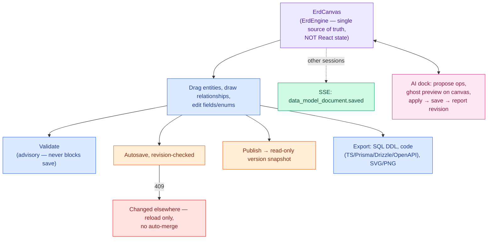
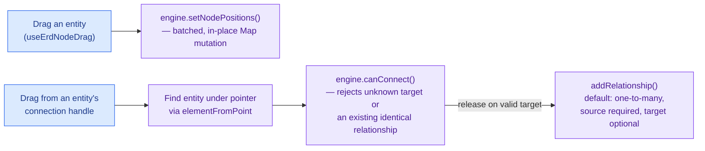
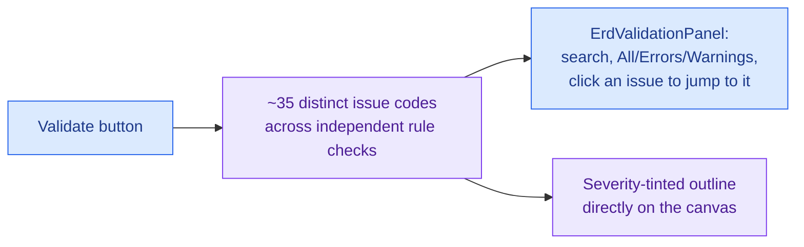
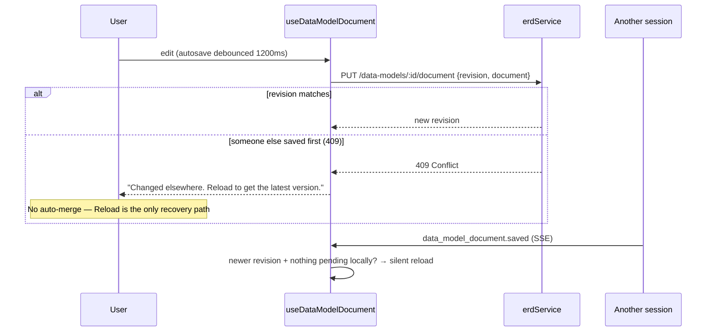
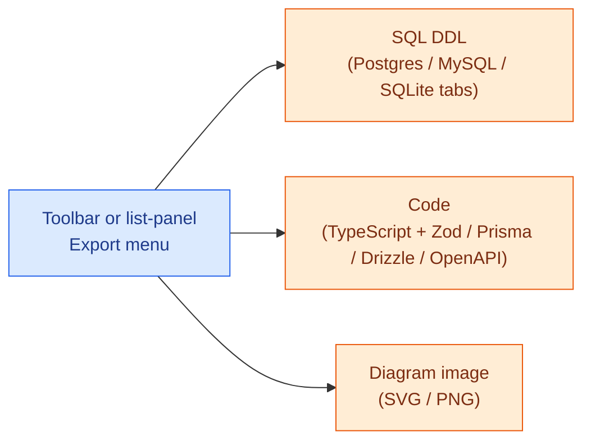
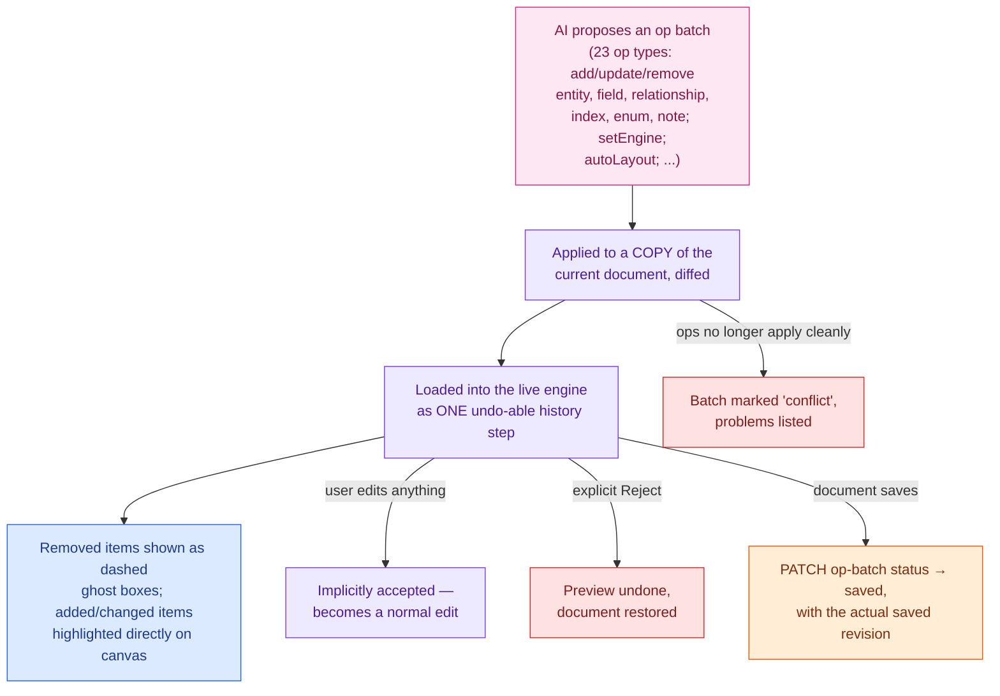

# Feature: Data Model (ERD Editor)

A full entity-relationship diagram editor: entities, fields, relationships, enums, and notes on an
infinite canvas, with validation, DDL/code export, versioning, and a deep AI integration that can
propose and apply changes directly onto the canvas.

> Color key (consistent across `docs/features/`): 🔵 user action · 🟣 client state · 🟠 network call ·
> 🟢 real-time (SSE) · 🩷 AI-specific · 🔴 error / rollback / conflict.

## At a glance

## 1. The canvas engine

Unlike most of this library, the data model editor's state is **not** React state — it's owned
entirely by a plain `ErdEngine` class (`src/utils/erd/erdEngine.ts`) holding entities, relationships,
enums, notes, selection, viewport, in-progress connection state, validation results, and its own
undo/redo history. React components read from it through a Zustand-like selector hook
(`useErdState`) and the engine emits `change`/`selectionChange`/`viewportChange` events so things
outside the selector tree (like the AI dock) can subscribe imperatively. This is why AI-applied
changes, manual edits, and undo/redo all compose cleanly — they're all just mutations on one engine.

Also on the canvas: marquee multi-select, panning, mouse-wheel zoom (shift = horizontal pan, ctrl =
zoom-at-cursor), drag-and-drop from the entity/note palette, and viewport culling for large models
(only entities/notes intersecting the visible viewport are mounted — selected items are always kept
mounted regardless).

## 2. Entities, fields, relationships, enums

- **Entity properties panel** (three tabs): General (name, schema, comment, collapsed state), Fields
  (add/edit/reorder fields, indexes, and a read-only list of relationships touching this entity), and
  Style (colors, a free-text "Group / subject area" used by the palette outline, and a **Locked**
  switch — locking an entity doesn't just dim the Style tab, it disables editing on the General and
  Fields tabs too, name included). Style also has an **"Add audit columns" helper** with three
  independent toggles, not one all-or-nothing action: **Timestamps** (`created_at`/`updated_at`, on by
  default), **Soft delete** (`deleted_at`, on by default), and **Actor tracking**
  (`created_by`/`updated_by`, **off** by default) — each skips any field that already exists by name.
- **Fields**: each row has inline `PK`/`NN`/`UQ` toggles plus an expandable detail section — type
  (from an engine-specific catalog, or a free-text custom type), enum assignment, length/precision as
  needed for the type, default value, comment, check constraint, and a generated-column mode
  (expression + stored/virtual, mutually exclusive with a default value).
- **Relationships** are created by **dragging between entity connection handles** — there's no "add
  relationship" button in the properties panel; once one exists, its properties panel lets you set
  cardinality, source/target-optional flags, on-delete/on-update actions, and a composite-key field
  pairing (up to 8 field pairs). A many-to-many relationship offers **"Materialize join table"**,
  which generates a real join entity with two FK relationships and removes the many-to-many edge.
- **Enums** support rename, reorder/add/remove values (each with an optional description), a read-only
  "used by" list, and two one-way transforms: **"Convert to table"** (builds a lookup entity and
  repoints every field that used the enum into a new relationship, then deletes the enum).

## 3. Validation (advisory, not a gate)

About 35 distinct issue codes run across five categories — model (empty model, mixed
naming-convention), entity (duplicate/empty/invalid name, no fields, no primary key), field
(duplicate/empty/invalid name, dangling enum reference, generated+default conflict), index (no
fields, dangling field reference, duplicate name), enum (duplicate name/value, empty, unused), and
relationship (dangling, composite-key length mismatch, duplicate, self-relationship, **many-to-many
without a join table always warns** since it's never auto-materialized, missing field, type mismatch,
FK not targeting a unique/PK field, FK without an index, circular relationships via full-graph cycle
detection, orphan entities once two or more exist). Plus engine-specific rules (reserved words,
identifier length limits, unsupported types) that differ by target engine
(PostgreSQL/MySQL/SQLite/N-A) — the "field needs an explicit length" check specifically is
**MySQL-only**; Postgres/SQLite/N-A never require one even for a `varchar`-like type.

**Validation never blocks Save or Publish.** You can persist an invalid model; the panel is purely
informational, re-checking itself 250ms after any relevant change while it's open.

## 4. Persistence, conflicts, and versioning

Document save uses the same optimistic-concurrency pattern used across this library: every save
carries the last-known `revision`; a mismatch is a `409`, surfaced as a persistent (non-dismissing)
banner with a **Reload** button — there is no merge UI, discarding local state and reloading is the
only path forward. If a newer revision arrives over SSE while you have no pending local edits, the
document reloads silently (nothing of yours to lose).

**Publishing** opens a confirmation ("the model becomes read-only once published"), saves any pending
changes first, then creates a version snapshot. This is **not** optimistic — the editor only locks
itself read-only once the publish call actually succeeds; until then the Publish button just shows a
busy/spinner state. **Version history** lets you preview any past version in a
fully separate, read-only editor instance — not the live engine — with a banner to exit preview;
there's no in-UI "restore this version" action.

Leaving the editor with **unsaved AI changes** (not manual edits — those autosave) is guarded with its
own confirmation ("If you leave now, they are discarded") plus a `beforeunload` handler.

## 5. Export

All four export formats are fully wired today — reachable both from inside the editor's toolbar and
from each row in the data-model list panel (which fetches the document on demand, gated by an
export permission), with copy-to-clipboard and download for every format.

## 6. AI integration

This is the most sophisticated AI integration in the library:

- **23 op types** (`src/features/ai/ops/types.ts`): full CRUD on entities, fields, relationships,
  indexes, enums, and notes, plus `setEngine`/`setModelName`/`setModelDescription`/`autoLayout`.
  Capped at 200 ops per batch, 500 entities, 200 fields/entity, 2000 relationships.
- **Streaming/incremental preview**: as the AI's plan streams in, a cheap "suffix" re-apply handles
  just the newly-arrived ops rather than reprocessing the whole batch from scratch, so the canvas
  updates live while the plan is still being generated.
- **Ghost preview**: entities the AI proposes to _remove_ are rendered as dashed, translucent boxes
  directly on the canvas (using a snapshot of the pre-change document) — you see exactly what's about
  to disappear before accepting anything. Added/changed entities get a highlight class instead.
- **Accepting is implicit**: the moment you edit the canvas yourself while a preview is showing, it's
  treated as accepted — there's no separate "Accept" button to click. There _is_ an explicit
  **Reject** (discards the preview, restores the prior document) and an **Undo last accepted batch**
  action, as long as nothing else has changed since.
- **The apply → save → report-revision loop**: once the host document's own autosave/manual-save
  completes and bumps its revision while AI-applied batches are pending, every one of those batches is
  automatically PATCHed to `status: "saved"` carrying the real saved revision — this is what lets the
  backend know definitively which document revision actually contains a given AI change (see
  `wec-pinnote-api`'s `AI_PROTOCOL.md` for the server side of this same handshake).
- **Document-level conflicts** (the AI's proposed ops no longer apply cleanly — e.g. it tried to edit
  an entity you just deleted) are distinct from the document-save conflict in §4: the batch itself is
  marked `conflict` with a list of the specific problems, shown inline in the AI dock.

## Scenarios covered

| Scenario                                                    | What happens                                                                                                           |
| ----------------------------------------------------------- | ---------------------------------------------------------------------------------------------------------------------- |
| Save while someone else just saved                          | 409 → persistent "changed elsewhere" banner, Reload is the only path forward (no merge)                                |
| Validation finds errors                                     | Shown in a panel, click-to-jump to the offending element — **never blocks Save or Publish**                            |
| AI proposes deleting an entity                              | Shown as a dashed ghost box before you accept anything                                                                 |
| You start editing while an AI preview is showing            | Implicitly accepted — treated as a normal edit from that point on                                                      |
| AI's proposed ops reference something that was just deleted | Batch marked `conflict`, specific problems listed, nothing silently half-applied                                       |
| Leaving the editor with unsaved AI changes                  | Confirmation dialog + `beforeunload` guard — manual edits never need this (they autosave)                              |
| Publishing                                                  | Confirmation, saves pending changes first; editor only locks read-only once the publish call succeeds (not optimistic) |
| Viewing a past version                                      | Opens in a fully separate read-only editor instance, not the live one                                                  |
| A field needs a length (e.g. `varchar` on MySQL)            | Flagged by validation, specific to the model's target engine                                                           |
| Converting a many-to-many relationship                      | "Materialize join table" builds a real join entity automatically                                                       |
| Converting an enum to a lookup table                        | Repoints every referencing field to a new relationship automatically                                                   |

## Keyboard shortcuts

`Ctrl/Cmd+I` ask AI · `Ctrl/Cmd+Z` undo · `+Shift` redo · `Ctrl/Cmd+Y` redo · `Ctrl/Cmd+A` select all ·
`Ctrl/Cmd+D` duplicate selection · `Delete`/`Backspace` delete selection · `+`/`-` zoom · `f` fit view
· arrow keys nudge (1px, 10px with Shift) · `Escape` cancel an in-progress connection or clear
selection. **Read-only mode (e.g. previewing a published version) only blocks the mutating ones** —
delete, undo/redo, duplicate, and nudge; `Escape`, zoom, fit-view, and select-all keep working since
they're just navigation, not edits.
