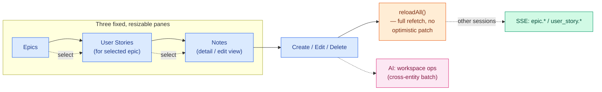
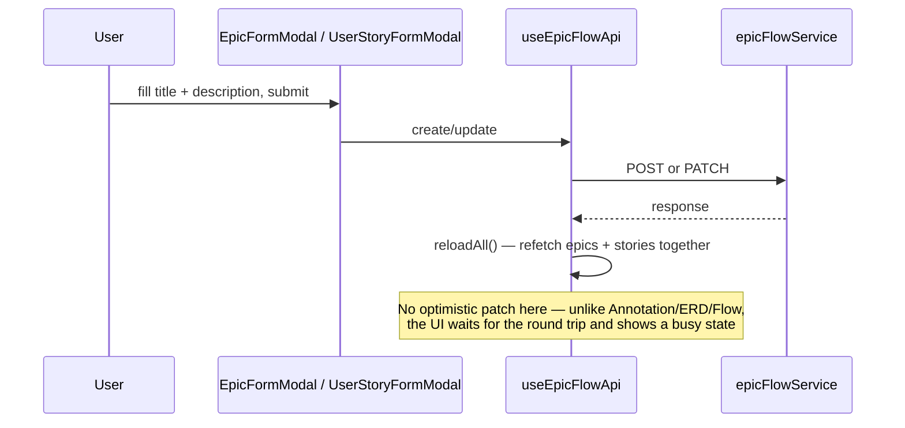
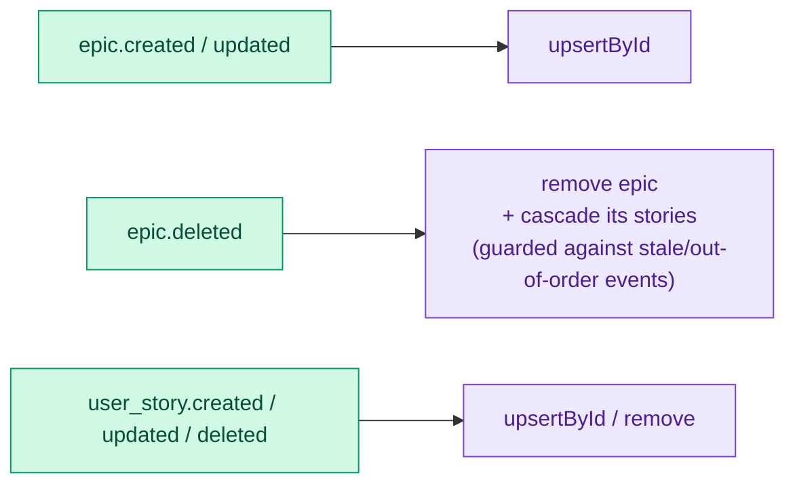
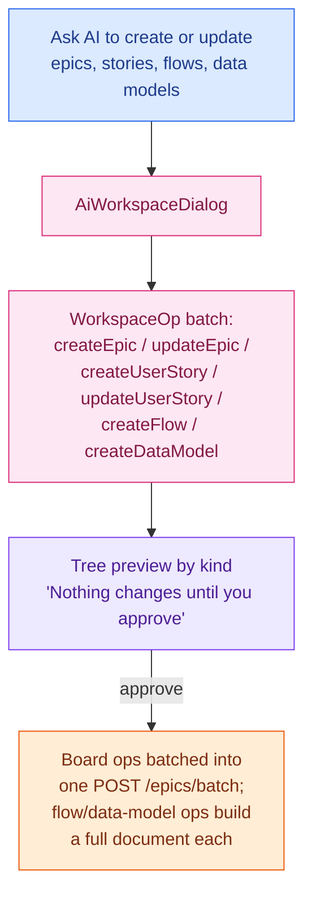

# Feature: EpicFlow

A lightweight project-planning board: epics containing user stories. Despite the "board" framing,
there is **no drag-and-drop and no status-based columns in the UI today** — it's a 3-pane
master-detail-detail picker. This is worth knowing up front since it differs from what "kanban board"
usually implies.

> Color key (consistent across `docs/features/`): 🔵 user action · 🟣 client state · 🟠 network call ·
> 🟢 real-time (SSE) · 🩷 AI-specific · 🔴 error / rollback / conflict.

## At a glance

## 1. Board layout

There is no drag-between-columns and no per-status grouping, even though `Epic`/`UserStory` both
carry an `EpicFlowStatus` (`backlog | in_progress | done | archived`) in their type — that field
exists but currently drives no filter, column, or visual distinction anywhere in this feature's
components. The actual layout is three resizable panes:

1. **Epics** — all epics in the project, paginated client-side (10 per page, "Show more").
2. **User Stories** — stories belonging to whichever epic is selected; selecting a different epic
   clears the story selection.
3. **Notes** — a detail/edit view of whichever epic or story is currently selected; can expand to
   fill the whole panel width, replacing the other two panes.

Pane widths are **not persisted** — dragging the resize handles between panes resets to equal thirds
on next mount. Each card shows only a title (clamped with "Show more/less" past 80 characters); author
and timestamp metadata live in the Notes pane's "Show details" section instead, not on the card.

## 2. Create, edit, delete

This is the one feature in the library that does **not** use an optimistic-update pattern for manual
edits — every create/update/delete is followed by a full `reloadAll()` (parallel refetch of epics and
stories), with a `busy` flag disabling the forms during the round trip. Local-state patching only
happens for events arriving over the real-time stream (below), not for your own writes. A board-batch
endpoint (`POST /epics/batch`) exists but is used only by the AI workspace-ops path, never by manual
form submission.

Title is capped at 1000 characters, description/"Notes" at 35,000, both required and trimmed. A
shared `CharCounterField` component shows a warning style at 90% of the limit and a stronger style at
100%. Editing a user story also lets you **re-target it to a different epic** via the same picker
used on create — moving it off the board you're currently looking at.

**Permissions**: anyone with board access can **edit** any epic or story — there's no ownership check
on edit at all; `boardPermissions.ts` does export a `canEditBoardItem()` helper that always returns
`true`, but nothing in the UI actually calls it — the "no check on edit" behavior comes from the Edit
action simply always being shown, not from that function being evaluated. **Deleting** requires being
the item's author, or having the `admin`/`super_admin` role (`canDeleteBoardItem`, same file) — the
same function also gates annotation-tag deletion and the Flow/Data-model list panels' delete actions;
comment edit/delete in the annotation feature uses its own, separate `canEditComment`/
`canDeleteComment` pair in the same module, not this function. Deleting an epic cascades its stories;
the confirmation dialog tells you how many stories will go with it.

## 3. Real-time sync

Same event-sourced model as every other feature: `epic.created|updated|deleted` and
`user_story.created|updated|deleted` are applied by a pure reducer
(`applyEpicFlowStreamEvent`). A stream "resync" (reconnect after a drop) triggers a full refresh. If
the currently-selected epic or story is removed by an incoming event, the selection is cleared.

## 4. Export

A single hard-coded JSON download per epic (`buildEpicExport` — the epic plus its sorted user
stories), triggered from the download icon on each epic's row. There's no multi-format export menu
here (unlike the ERD/Flowchart export dialogs) and no bulk/project-wide export, and user stories
aren't individually exportable — only whole epics.

## 5. AI integration — workspace ops

Epics and user stories **are** AI-editable, but through a different, simpler mechanism than the
canvas-based op-batch system used by the ERD and Flowchart editors:

The **"Ask AI" workspace dialog** (opened via `AiWorkspaceButton`, found in the EpicFlow panel header
and in the Notes pane) is a single surface for proposing work across epics, stories, flows, _and_ data
models in one batch — a flat, cross-entity op vocabulary (`WorkspaceOp`), distinct from the
per-document `ErdOp`/`FlowOp` types used inside those editors. The proposal is shown as a textual tree
grouped by kind, not an inline ghost-overlay on the board (there's no equivalent of the ERD/Flowchart
canvas preview here). Applying batches consecutive board operations into a single
`POST /epics/batch` call; a `createFlow`/`createDataModel` op instead runs the normal
`applyFlowOps`/`applyErdOps` engine to build a full document. The batch goes through the same
`proposed → applying → applied → saved` status lifecycle as every other AI op batch in this library,
with resumable/idempotent re-application so retrying after a partial failure can't create duplicates
— ops that depend on one that failed (e.g. a user story under an epic whose creation errored) are
marked **skipped**, a distinct status from a hard failure, rather than aborting the rest of the batch.
A batch also guards against two people approving the same AI proposal at once: applying claims a lock
first, and a second concurrent attempt is rejected rather than double-applying.

## Scenarios covered

| Scenario                                                                        | What happens                                                                                                                       |
| ------------------------------------------------------------------------------- | ---------------------------------------------------------------------------------------------------------------------------------- |
| No epics exist yet                                                              | "No Epics available" empty state                                                                                                   |
| Epics exist but none match the search                                           | "No epics match your search." (a different message from the true-empty state)                                                      |
| No epic selected                                                                | Stories pane: "Select an Epic to view User Stories"; Notes pane: "Select an Epic to view User Stories and Notes"                   |
| Deleting an epic with stories                                                   | Confirmation names how many stories will be permanently deleted along with it                                                      |
| User without delete rights                                                      | The delete icon simply isn't rendered — no disabled-button/error-on-click path                                                     |
| Stream reconnect after a drop                                                   | Full board refresh (`resync`), not just resumed event delivery                                                                     |
| AI proposes cross-entity work (an epic, two stories, and a flow in one request) | One combined preview tree, approved or discarded as a unit, applied as one batch with board ops grouped into a single network call |
| A user story's epic op fails mid-batch                                          | Its own story ops are marked **skipped** (not failed) rather than aborting the rest of the batch                                   |
| AI batch partially fails mid-apply                                              | Resumable — retrying doesn't duplicate already-created items                                                                       |
| Two people try to apply the same AI proposal at once                            | The second attempt is rejected — a lock prevents double-applying                                                                   |
| Editing a user story                                                            | You can re-target it to a different epic from the same form, not just edit its text                                                |

## What's _not_ here (worth knowing, not a bug)

- No drag-and-drop between stages, no status columns, no kanban swimlanes — a flat `EpicFlowStatus` on
  the data model is currently unused by the UI.
- Pane widths reset on remount — not persisted like other panels' sizes are.
- No optimistic updates on manual edits — every write waits for a full reload.
- No revision/conflict system — unlike the ERD and Flowchart documents, epics and stories have no
  optimistic-concurrency counter; the real-time stream is the only thing keeping multiple sessions in
  sync, and a plain last-write-wins PATCH is all that guards concurrent edits.
