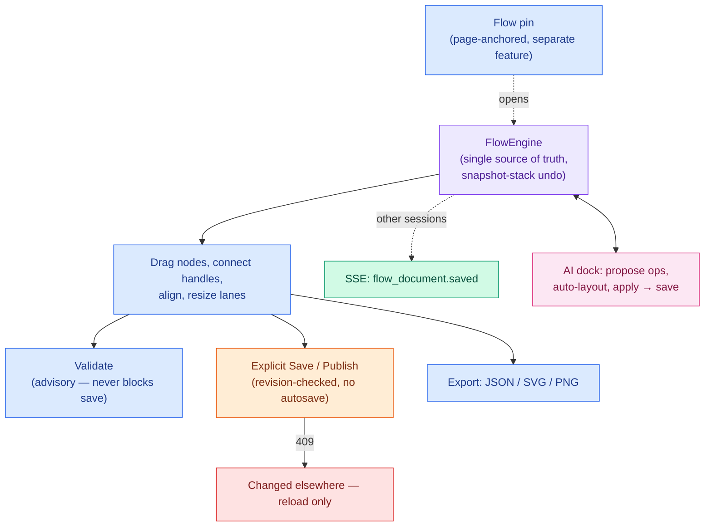
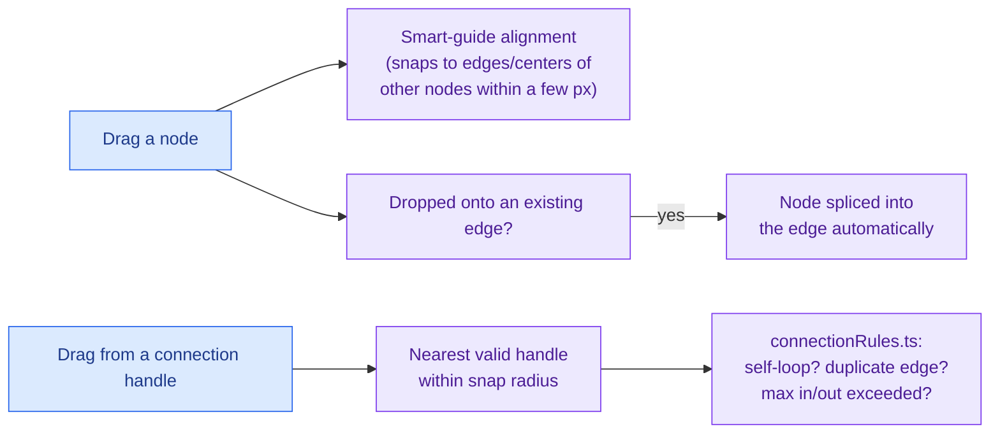
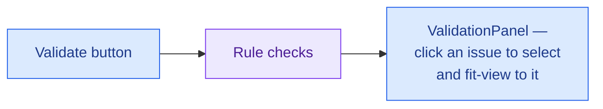
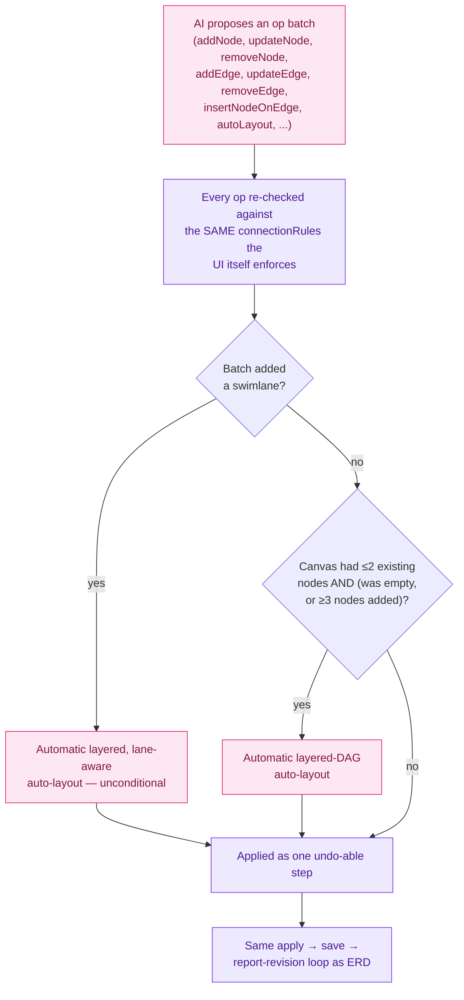

# Feature: Flowchart (WecFlow)

A general-purpose flowchart/diagram editor: nodes, edges, swimlanes, alignment guides, validation,
undo/redo, and the same AI op-batch integration pattern as the Data Model editor. Architecturally a
close sibling of [DATA_MODEL.md](DATA_MODEL.md) — both sit on the same kind of engine/store/
revisioned-document/AI-preview machinery, just with a different domain vocabulary (nodes/edges
instead of entities/relationships).

> Color key (consistent across `docs/features/`): 🔵 user action · 🟣 client state · 🟠 network call ·
> 🟢 real-time (SSE) · 🩷 AI-specific · 🔴 error / rollback / conflict.

## At a glance

## 1. The canvas engine

Same architectural shape as the ERD editor: a plain `FlowEngine` class
(`src/utils/flowchart/flowEngine.ts`) owns nodes, edges, selection, viewport, in-progress connection
state, validation, and undo/redo in one internal store; React reads it through a selector hook and
subscribes to `change` events.

**One important difference from the ERD canvas**: undo/redo here is a plain **snapshot stack**
(push the whole `{nodes, edges}` before each change), not a command/diff pattern — simple and
reliable, at the cost of each undo step being a full snapshot rather than a minimal diff. Multi-step
interactions (a drag, a paste, a batch of property-panel edits while one field is focused) are
coalesced into a single snapshot via explicit begin/end-interaction boundaries, so undo doesn't
require pressing Ctrl+Z once per intermediate frame of a drag.

## 2. Nodes, shapes, and quick-add

- **Built-in node types**: start, process, decision (diamond, with "yes"/"no" handles), end,
  subprocess, integration, plus generic shapes (circle, square, rectangle, rounded rectangle, ellipse,
  triangle, hexagon, cylinder, text, actor/person), and two lane types (horizontal and vertical
  swimlanes). Each type defines its own color, icon, default/min size, which handles it exposes, and
  incoming/outgoing connection limits (a Start node accepts no incoming edges; an End node sends no
  outgoing edges).
- **Inline rename**: double-click (or the moment a node is created — new nodes default straight into
  rename mode) edits the label in place; Enter/blur commits, Escape cancels.
- **QuickAdd**: small "+" buttons appear at each outgoing handle of a selected/hovered node — click to
  pick a type from a searchable list, or Shift-click to add a "process" node directly, both
  auto-connected to the node you started from.

## 3. Validation (advisory, not a gate)

Checks: exactly one Start node (error if none, warning if more than one), at least one End node,
every edge passes the same connection rules the live canvas enforces, nodes with no connections at
all, nodes unreachable from Start (BFS), non-end nodes with incoming but no outgoing edges ("dead
ends"), decision nodes with fewer than two outgoing branches, and nodes whose type isn't in the
registry. **Exactly like the Data Model editor, this never blocks Save or Publish** — it's an
advisory side panel only, re-validated on a short debounce while open.

## 4. Persistence and conflicts

Same revisioned-document pattern as the Data Model editor (`useRevisionedDocument`, shared hook), with
one deliberate difference: **this editor does not autosave** — Save and Publish are explicit actions,
not a debounced background save. A `409` on save surfaces the same kind of persistent
"changed elsewhere, Reload" banner, with no merge UI. If a newer revision arrives over the real-time
stream while nothing is pending locally, the document reloads silently.

## 5. Alignment and guides

Dragging a node checks its edges/center against every other node's edges/center within a small pixel
threshold (scaled by zoom level); a match renders a guide line (`HoverArrows`) and snaps the drag to
it. The same underlying geometry also powers explicit toolbar align/distribute actions on a multi-node
selection.

## 6. Flow pins vs. the full editor

**Flow pins are a separate, lighter-weight feature** — a page-anchored pin (using the exact same
anchor mechanism described in [ANNOTATION.md](ANNOTATION.md)) that references or creates a flow. They
have their own CRUD and draft lifecycle and do **not** touch the `FlowEngine` at all; opening a flow
pin is simply the entry point that resolves a `flowId` and then mounts this editor against it.

## 7. AI integration

The op vocabulary mirrors the ERD side (`addNode`, `updateNode`, `removeNode`, `addEdge`,
`updateEdge`, `removeEdge`, `insertNodeOnEdge`, `setFlowName`, `setFlowNotes`, `autoLayout`), and an
AI-proposed edge can never violate a rule the manual UI wouldn't also reject — the AI apply path runs
through the exact same validator. One capability unique to this feature: an **automatic layered-DAG
auto-layout**. It has two independent triggers — adding a **swimlane** always triggers a lane-aware
layout pass, full stop, regardless of how much else is already on the canvas; separately, a batch that
adds enough nodes to a near-empty canvas also triggers it, but only when the canvas had **at most 2
pre-existing nodes** to start with (an empty canvas accepts any addition; a canvas with 1–2 existing
nodes needs at least 3 new ones) — a batch of any size added to a canvas that already has 3+ nodes
never auto-triggers a layout pass on its own. Preview, accept-by-editing, explicit reject, and the
apply→save→report-revision handshake back to the backend all work identically to the Data Model
editor — see [DATA_MODEL.md §6](DATA_MODEL.md#6-ai-integration) for the shared mechanics in full
detail; this doc doesn't repeat them.

## 8. Export

JSON (the raw document), SVG, and PNG (rasterized client-side from the SVG) — all from the toolbar's
Export menu, with no server round-trip required for any of them.

## Scenarios covered

| Scenario                                              | What happens                                                                                |
| ----------------------------------------------------- | ------------------------------------------------------------------------------------------- |
| Save while someone else just saved                    | 409 → persistent banner, Reload only, no merge                                              |
| Validation finds a dead end or unreachable node       | Shown in a panel, click-to-jump — never blocks Save/Publish                                 |
| AI proposes an edge the UI itself would reject        | Impossible by construction — the AI apply path runs the same validator                      |
| AI adds a swimlane                                    | Always triggers a lane-aware auto-layout pass, regardless of how much else is on the canvas |
| AI adds 3+ nodes to a canvas that already has several | No auto-layout — the near-empty-canvas trigger only fires when ≤2 nodes existed beforehand  |
| Dragging a node onto an existing edge                 | The node is spliced into that edge automatically                                            |
| A decision node has fewer than two outgoing branches  | Flagged as a validation warning (not blocking)                                              |
| Opening a flow from a page pin                        | Resolves `flowId`, mounts this editor — the pin itself has no document state of its own     |
| Read-only mode (e.g. no publish rights)               | All editing shortcuts and node-drag are no-ops                                              |

## Keyboard shortcuts

`Escape` cancel connection / clear selection · `+`/`-` zoom, `1` zoom to 100% · `f` fit view ·
`Ctrl/Cmd+C`/`X`/`V` copy/cut/paste · `Ctrl/Cmd+A` select all · `Delete`/`Backspace` delete selection ·
`Ctrl/Cmd+Z` undo (`+Shift` or `Ctrl/Cmd+Y` redo) · `Ctrl/Cmd+D` duplicate · arrow keys nudge
(1px, 10px with Shift). All disabled in read-only mode or while focus is in an editable field.
