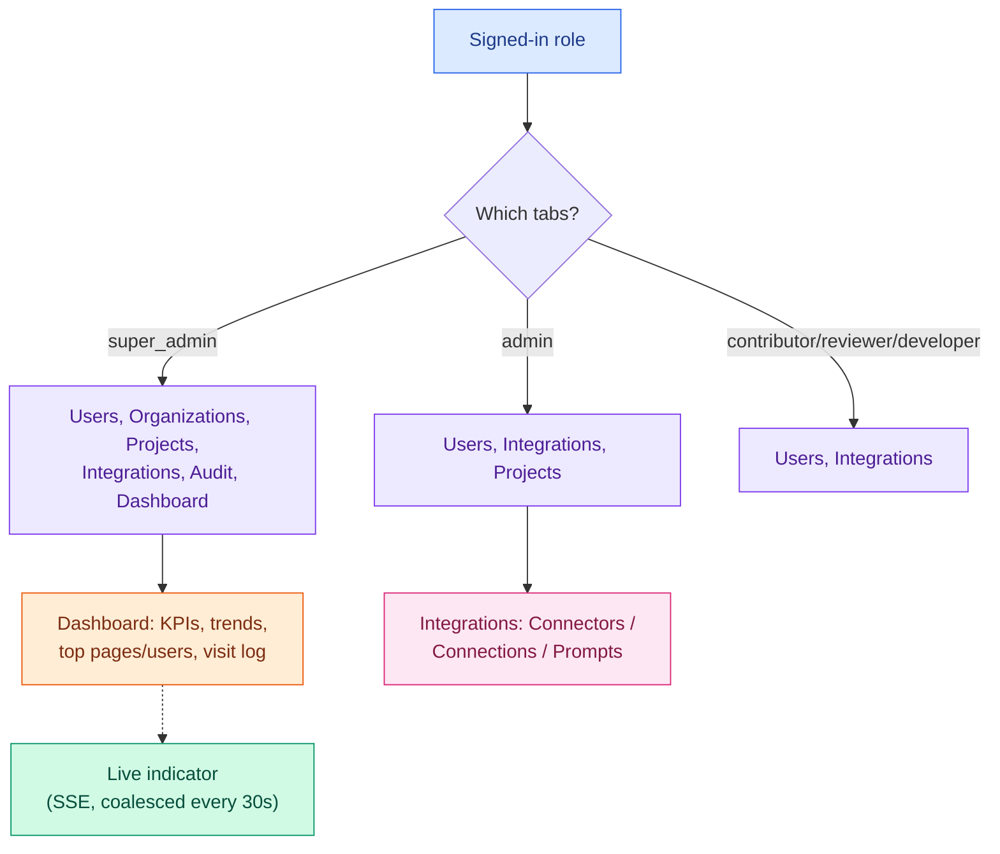
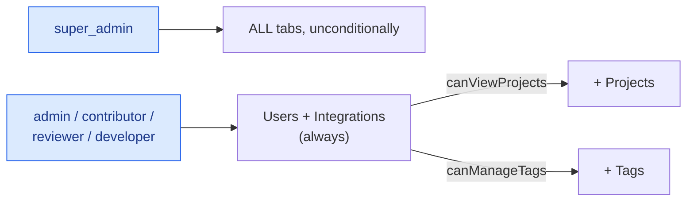
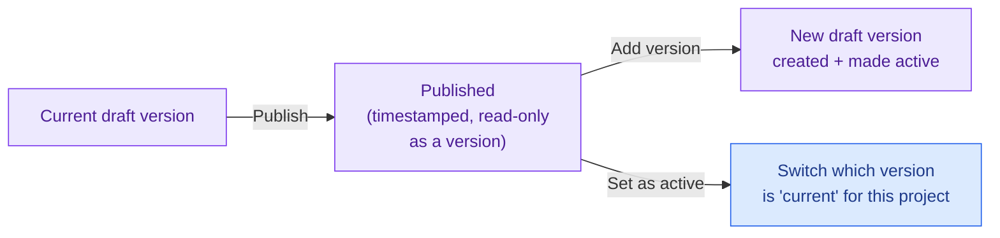
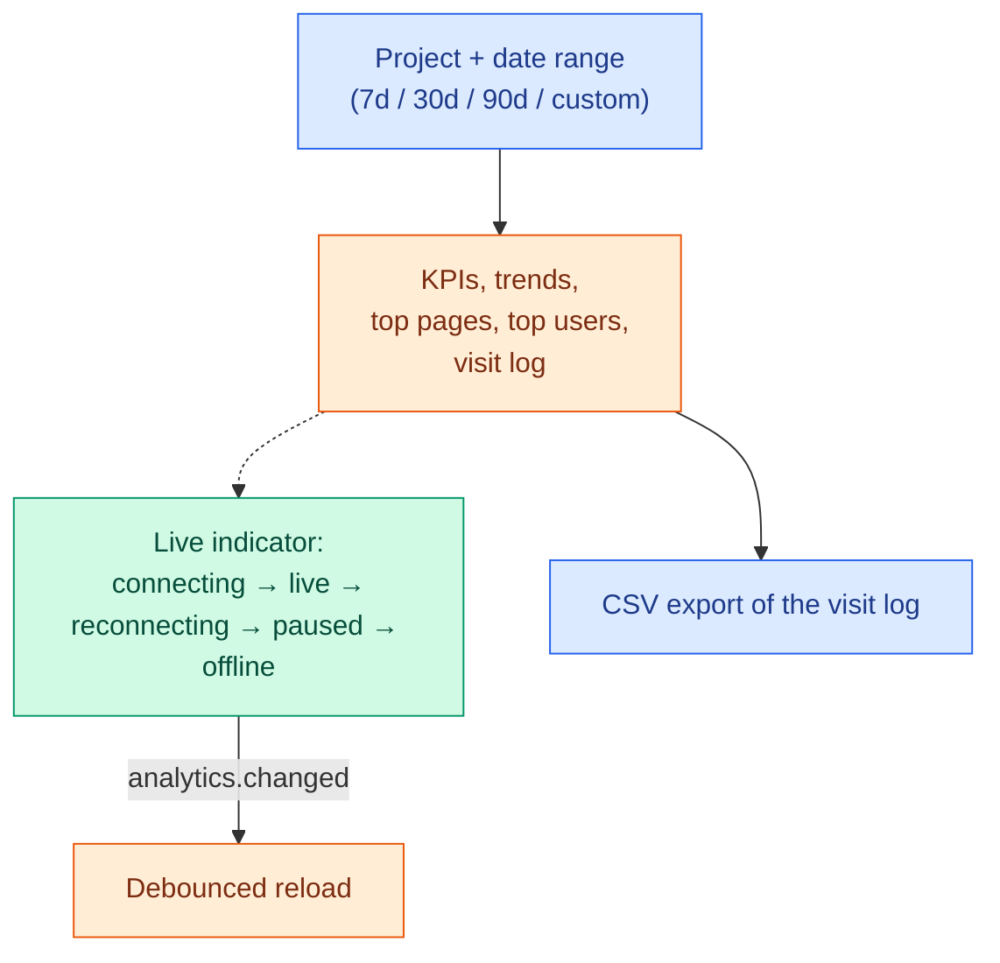
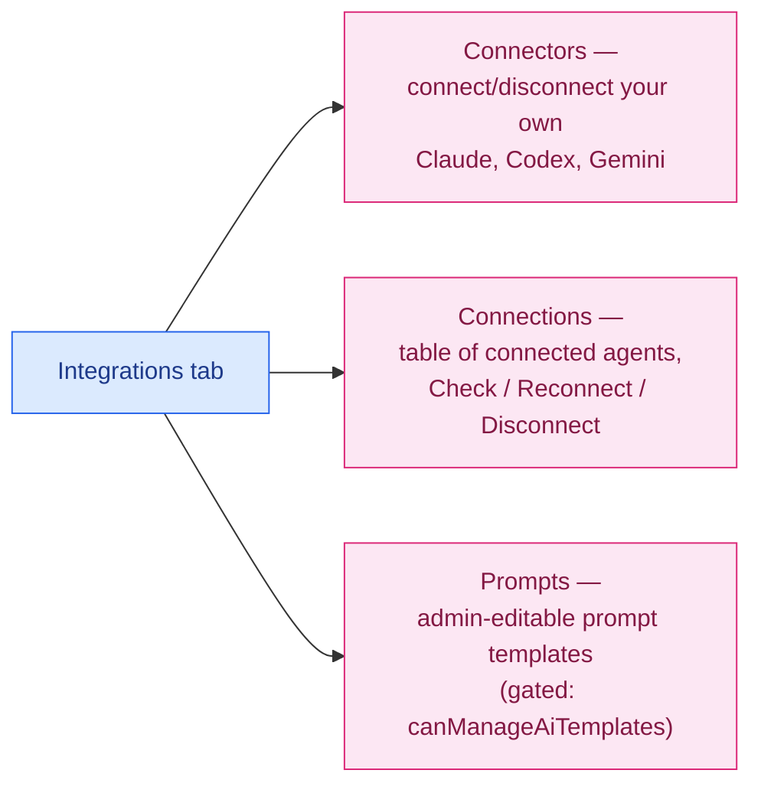

# Feature: Settings

The admin surface: organizations, projects, tags, users, project versioning, an analytics dashboard,
and AI integrations management. Which tabs you see depends entirely on your role.

> Color key (consistent across `docs/features/`): 🔵 user action · 🟣 client state · 🟠 network call ·
> 🟢 real-time (SSE) · 🩷 AI-specific · 🔴 error / rollback / conflict.

## At a glance

## 1. Tab visibility by role

Base rule (`src/features/settings/components/settingsTabs.ts`): `super_admin` sees every tab, always.
Everyone else starts with **Users** and **Integrations**, then gains **Projects** if their role can
view projects (`admin` and above), and **Tags** if their role can manage tags (`admin` and above).
**Organizations**, **Audit**, and **Dashboard** are `super_admin`-only, full stop — no other role ever
sees them.

One thing worth flagging explicitly: the **Tags tab is currently hidden from navigation for every
role, including `super_admin`** — a `HIDDEN_TABS` set is applied unconditionally after the role
filter, even though the Tags admin UI itself is fully implemented and wired up. If you're looking for
it and can't find it in the nav, that's why — it isn't a permissions problem on your account.

If the currently-active tab isn't in your role's visible set (e.g. your role changed mid-session), the
panel silently falls back to the Users tab rather than showing an error.

## 2. Organizations and Projects

Standard CRUD forms behind a shared generic table-with-create/edit/delete hook
(`useResourceTable`) that handles background-refresh caching (shows cached data instantly while live
data loads in behind it), a single form-modal for both create and edit, a delete confirmation flow, an
auto-dismissing success toast, and parsed field-level validation errors from 400 responses. Search is
**explicit, not live-as-you-type** — nothing refetches until you press Enter/Search or hit Clear.

- **Organization**: company name (required), a URL slug auto-derived from the name until you edit it
  manually, country, active/inactive status.
- **Project**: name (required), organization (required, searchable), status, description. The
  project's id is server-generated and shown read-only once created.

## 3. Tags (admin palette)

The admin-side tag **vocabulary** (name, color, project assignment, active/inactive status) — distinct
from the page-pinned tag markers end users place on elements (see
[ANNOTATION.md §6](ANNOTATION.md#6-tags-on-page)). A tag isn't tied to a single project the way it
might look — creating one lets you multi-select several projects at once, and doing so creates one
**separate tag record per project**, not one shared tag visible across all of them. As noted above,
this tab is fully built but currently unreachable via the nav for any role.

## 4. Project versioning

This is a **project-level** versioning concept — distinct from both the Flow document's `revision`
counter and the Data Model's publish/version-snapshot system described in their own docs. It governs
whether annotations and flows stay pinned to the project version they were created against. You can't
have two drafts at once — "Add version" is only available once the current draft has actually been
published. Two toggles (visible in this panel) control whether annotations and flows respectively
travel with a specific version or float independently of it — a third, `tagVersioningEnabled`, exists
in the underlying API but isn't surfaced in this panel's UI at all today. **Publishing itself is
gated by these toggles**: if both annotation and flow versioning are off for the project, the Publish
button is disabled with a "Publishing is paused — turn on version tracking for annotations or flows to
publish" warning (worded as a request to a super admin if you can't change the toggle yourself).

## 5. Dashboard (analytics)

`super_admin` only. KPI cards show total users, login counts (total/unique/failed), comment and
annotation totals (with an annotations-by-status breakdown), alongside a daily trend chart, top-pages
and top-users tables, and a paginated visit log with CSV export. The **live indicator** is driven by a
ticket-authenticated SSE connection that auto-pauses when the tab isn't visible and resumes (forcing a
resync) when it becomes visible again — change signals are coalesced into one update at most every 30
seconds, not streamed per-row.

The dashboard's own gate is about **data availability**, not permissions — if the backend's analytics
tables aren't migrated yet, it shows an explicit "apply the analytics table scripts" message rather
than an empty or broken dashboard; role gating for the tab itself happens one level up, at the
tab-visibility layer in §1.

## 6. Integrations

This tab is a thin shell over three sub-surfaces, all actually implemented in the AI feature — see
[AI.md §4](AI.md#4-connectors-ui) for the connector flows themselves and
[AI.md §8](AI.md#8-prompt-template-administration) for the Prompts workbench. Any disabled AI action
elsewhere in the app that needs a connection ("Connect Claude, Codex or Gemini...") deep-links
straight into the correct sub-tab here.

## 7. Caching

Table data for Organizations/Projects (and the AI "me"/sessions/action-templates data for the
Integrations tab) is prefetched on hover/focus of the relevant nav item, with a 30-second TTL —
clicking into a tab you just hovered over typically shows data instantly rather than a loading state.

## Scenarios covered

| Scenario                                                         | What happens                                                                                           |
| ---------------------------------------------------------------- | ------------------------------------------------------------------------------------------------------ |
| Your role changes while a non-visible tab is active              | Silently falls back to the Users tab                                                                   |
| You look for the Tags tab                                        | Not in the nav for anyone right now — a known, deliberate gap, not a permission issue                  |
| Analytics tables aren't migrated on this backend                 | Dashboard shows "apply the analytics table scripts," not a blank/broken page                           |
| The live analytics stream drops                                  | Indicator shows "reconnecting," then "paused" if the tab is hidden, resyncing on return                |
| You try "Add version" with an unpublished draft already active   | Not available — only one draft can exist per project at a time                                         |
| Both annotation and flow versioning are turned off for a project | Publish is disabled with an explicit "turn on version tracking" warning, not just silently unavailable |
| An org/project form submission fails validation                  | Field-level errors shown inline in the modal, plus a dismissible toast                                 |
| No projects exist yet                                            | Tags tab (if ever made reachable) shows "Create a project before adding tags"                          |
| No agent connected yet                                           | Connections table shows "You haven't connected an agent yet" with a direct link to Connectors          |
